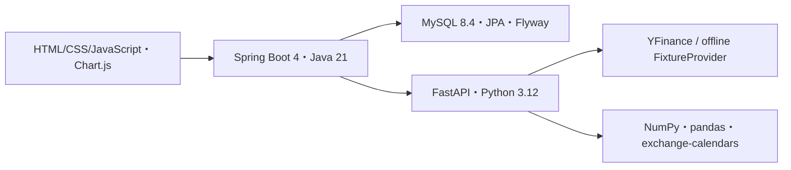

# Markov Stock Analyzer

日本株の日次変化を3状態のマルコフ連鎖で観察する、研究・教育用Webアプリです。
条件・価格版・分析／バックテスト結果を保存し、根拠と履歴を確認できます。
**投資助言・売買推奨ではありません。状態確率や正解率は投資利益を意味しません。**

## 実装済みの機能

- 登録銘柄と条件の選択・保存・複製
- 現在状態、遷移回数・確率、1/3/5/10取引日後の状態分布・警告
- 保存価格の価格／リターン／状態グラフと表、出典と計算版
- 翌取引日のexpanding walk-forwardバックテスト、予測／スキップ明細・ページング
- accuracy、状態別precision／recall、混同行列、coverage、Brier score、log loss
- 最頻状態・直前状態の基準モデルとの、同じ予測対象日での比較
- MySQLへの保存、分析／バックテスト履歴の種類・銘柄フィルタ
- 人工データによるofflineブラウザE2E

## 計算の仕組み

提供元の調整後終値から日次リターンを求めます。初期閾値は±0.5%です。

| 状態 | 分類（初期値） |
|---|---|
| UP | リターン > +0.5% |
| FLAT | −0.5% ≤ リターン ≤ +0.5%（境界を含む） |
| DOWN | リターン < −0.5% |

順序は常に`UP / FLAT / DOWN`。隣接状態の遷移回数を行ごとに正規化して
最尤推定（`MLE_STRICT`）し、現在状態のone-hot分布と行列の累乗から
1/3/5/10ステップ後の分布を計算します。将来価格そのものは予測しません。

出発観測がない行は`[null,null,null]`です。平滑化・補完せず、
`ZERO_ROW_UNESTIMATED`、`predictionStatus=UNAVAILABLE`、`forecasts=[]`として表示・保存します。
バックテストでは該当起点をスキップし、全件スキップの指標は0ではなくnullです。

バックテストは学習期間を拡大する`EXPANDING`方式、翌取引日・horizon=1です。
各起点までのデータだけで学習し、その後の実状態で評価します。
候補・予測・スキップ件数とcoverageを併記し、予測できた日の正解率だけを過大評価しません。

XTKS／Asia/Tokyoを使用し、開始日前の直前取引日の価格も取得します。
休日は補完せず、予定取引日の欠測は`DATA_GAP`として拒否します。
価格は10桁小数で正規化し、ハッシュ・取得日時・カレンダー版・計算版を保存します。
上限は5暦年、1,300状態、バックテスト候補1,000件、本文5MiB、Python同時実行1件です。

## 構成・技術



フロントエンドの正本は`frontend/`。Mavenが静的資産を取り込み、Spring Bootが配信します。
Javaは入力検証・内部HTTP・結果不変条件検証・保存、Pythonは計算を担当します。
PythonはDBへ接続しません。[凍結OpenAPI](docs/api/openapi-internal.json)を契約テストで確認します。
公開出典は保存価格版、provenanceはruntimeの許可項目のみです。
保存系列は保存したengineVersionを要求し、対応しない版は409で停止します。

ComposeはMySQL・FastAPI・Javaの3サービス。ブラウザ用ポートのみを
`127.0.0.1:8080`へ公開し、MySQL／FastAPIのポートは公開しません。

## 起動と使い方

Git、Docker Desktop（WindowsではWSL2/Linux containers）を用意し、
[setup手順](docs/setup.md)に従ってclone、`.env`作成、秘密値設定を行ってください。

```powershell
docker compose up --build -d
docker compose ps
```

`http://127.0.0.1:8080/`を開きます。

1. 分析画面で銘柄・期間・閾値・条件名を入力し、保存して分析します。
2. 現在状態、観測数、行列、確率、警告、系列と出典を確認します。
3. 「この条件とデータでバックテスト」から評価期間・最小学習状態数を指定します。
4. 指標・基準モデル・予測／スキップ明細を確認します。
5. 履歴で絞り込み、保存した結果を開きます。履歴取得は再取得・再計算しません。

保存結果の表示はGETのみ。系列は保存価格・保存計算版による再構成です。
新規分析のdatasetId省略時は24時間キャッシュ判定／取得、指定時は整合性確認後に価格版を再利用します。
POSTは二重実行を抑止し、自動再試行しません。ブラウザの待機中止はサーバー処理中止を保証しません。

## テストとCI

[詳細コマンドとDocker版Pythonテスト](docs/setup.md#regression-tests)を参照してください。

```powershell
cd analysis
uv sync --locked
uv run pytest
uv run python -m compileall -q app tests
cd ../backend
.\mvnw.cmd verify
cd ../frontend
npm ci --ignore-scripts
npm test
```

Java検証には本物のMySQL Testcontainers、Flyway、制約・保存・ロールバック検証が含まれ、Dockerが必要です。
CIはPython／契約、Java／MySQL、frontend／Git安全性、offline E2Eの4ジョブ。
Javaの失敗・スキップを拒否し、Pythonコアの行カバレッジ90%を検証します。
Python専用lintは未導入です。compileall、テスト、契約・秘密検査を実行します。

通常テスト・CIは実市場APIを呼びません。E2Eの価格は人工生成CSVで、提供元も`FIXTURE`です。
実市場接続は明示的な手動操作のみ。登録`9001 / TEST`は人工テスト用で、実市場取得用ではありません。
`node scripts/manual-yfinance-check.mjs --run-once`は登録7203.Tを1回だけ取得し、内部fetch→analyzeを確認します。
実価格はメモリ内に留め、ファイル・DBへ保存しません。
検証結果と受入れ判定は[検証記録](docs/release-readiness.md)にあります。

## 限界と公開範囲

- マルコフ性と期間内の時間同質性を仮定しています。市場の非定常性や少数標本により、過去の行列が将来を説明できるとは限りません。
- 取得時点の調整後価格は分割・配当・改訂を反映します。当時見えていた価格を完全再現するpoint-in-timeデータではありません。
  保存版の再現性と、当時の情報集合の再現性は区別します。
- 条件を繰り返し試すと過学習になり得ます。生存者バイアス、取引コスト、流動性、利益評価は扱いません。
- 5状態、スライディング窓、複数銘柄比較、定常分布診断、ログイン、取引、クラウド公開は未実装です。
- 認証・所有者管理がないローカルMVPです。インターネット公開にはTLS、認証、所有者チェック、レート制限等が必要です。
  現ComposeはFlywayと実行時DBアカウントも共用です。資料・コードの提出と不特定多数向けサービス公開は区別してください。

## ライセンスと市場データ

コードは[MIT License](LICENSE)。同梱Chart.js／依存色ライブラリの通知は[vendor license](frontend/vendor/LICENSE.chartjs.md)にあります。
コードのライセンスは市場データ再配布権を付与しません。提供元・取引所の利用条件を確認し、実株価ダンプ・CSV・JSONをGitや公開デモへ掲載しないでください。
ローカルデータはGit除外済みの`data/`、`exports/`、`backups/`等へ保管し、`.env`・秘密鍵・DBダンプ・E2E成果物もコミットしないでください。
