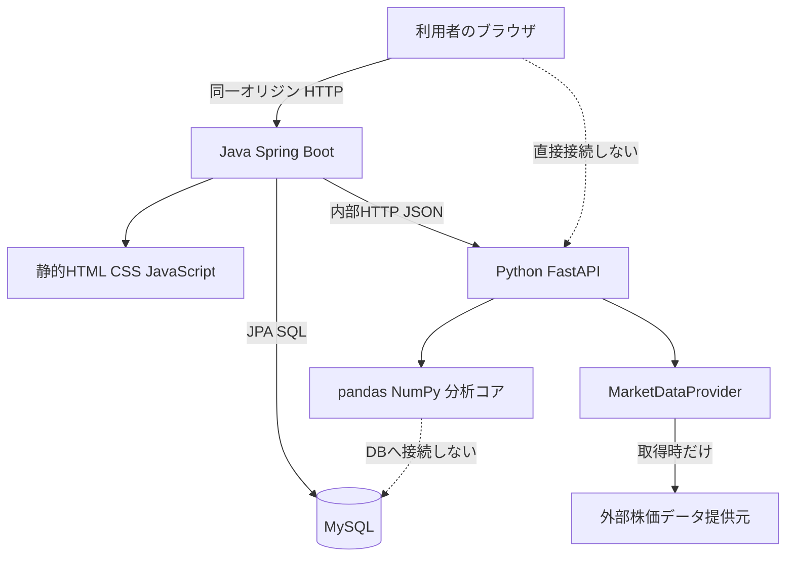
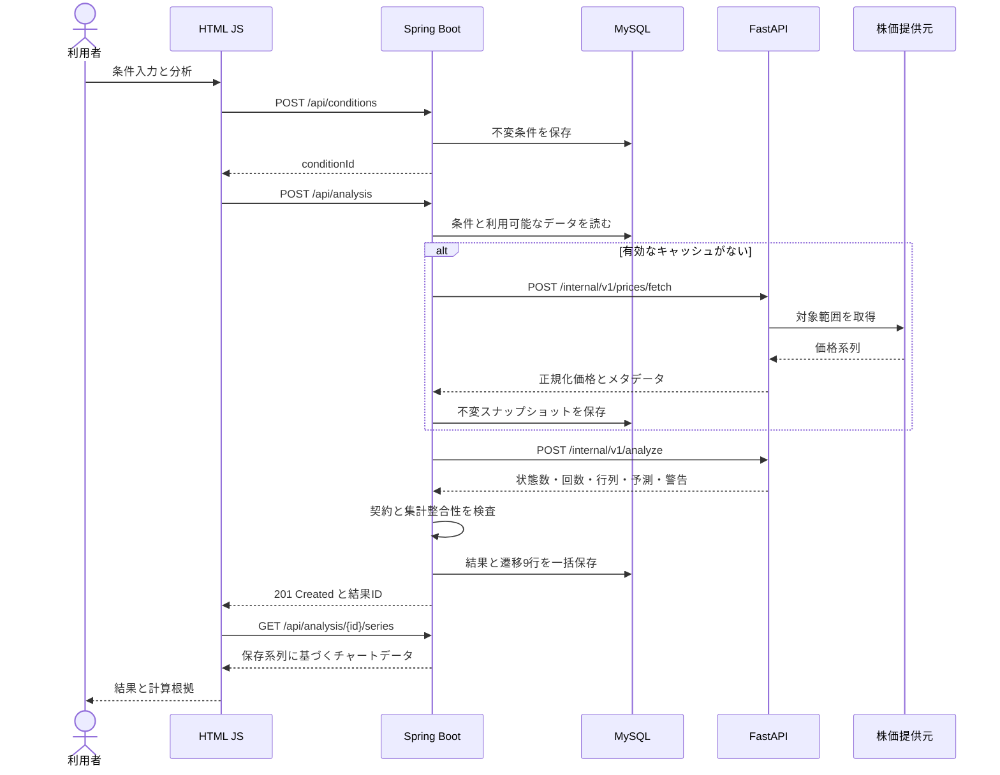
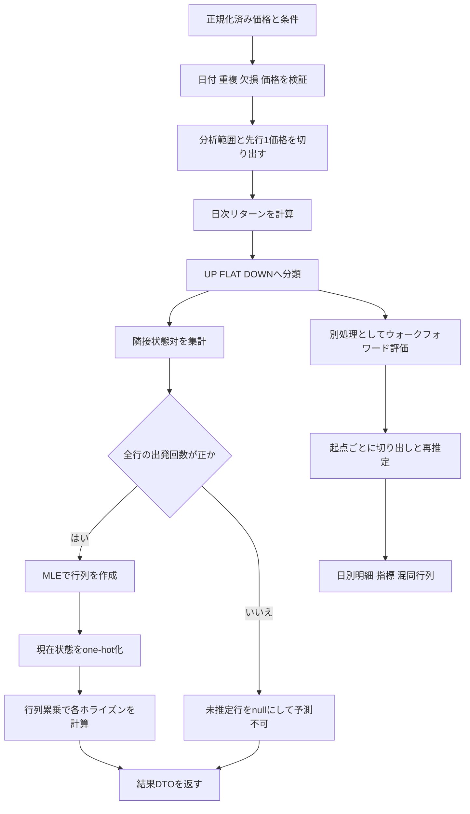
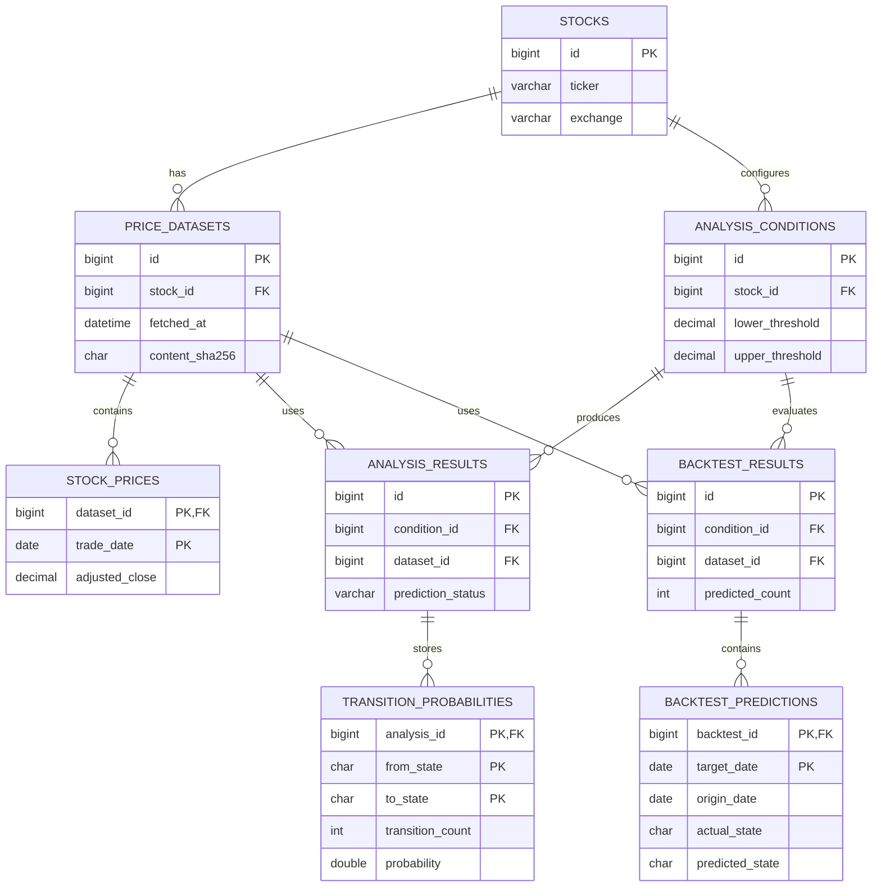
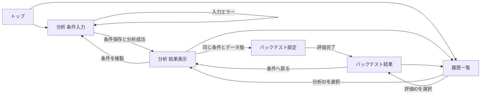

# Markov Stock Analyzer システム設計計画書

## 1. 文書概要

| 項目 | 内容 |
|---|---|
| プロジェクト名 | Markov Stock Analyzer |
| リポジトリ名 | `markov-stock-analyzer` |
| 文書版 | 1.1 |
| 改訂日 | 2026年9月25日 |
| 文書区分 | システム設計・実装計画 |
| 対象リリース | 初期リリース（MVP） |
| ステータス | 設計段階 |

本書は、株価変動をマルコフ連鎖で分析するWebアプリケーションについて、要件、分析仕様、システム構成、インターフェース、データモデルおよび検証方針を定義する。

**フロントエンド、Spring Boot、Python分析サービスを分離し、MySQLへのアクセスをSpring Bootに集約する。** 分析過程の可視化と入力データの再現性を重視し、推定根拠を確認できるシステムとする。

本書に記載する機能および性能値は設計仕様・目標値である。数値例は検証用の人工データであり、実在銘柄の分析結果や予測精度を示すものではない。MySQL 8.4上のDDL実行試験とアプリケーション全体の試験は、実装時に実施する。

### 1.1 文書構成

| 分類 | 内容 |
|---|---|
| 要件・分析仕様 | プロジェクト概要、対象範囲、MVP、機能・非機能要件、数理モデル |
| アプリケーション設計 | システム構成、技術選定、データフロー、各サービス、API |
| データ・画面設計 | テーブル定義、DDL、ER図、画面、グラフ、ディレクトリ構成 |
| 品質・保守方針 | 異常系、セキュリティ、テスト、変更管理、受入れ基準 |
| 拡張・運用方針 | リスク、将来拡張、理論と実装の対応、ドキュメント管理 |

### 1.2 設計前提

本システムの設計前提を以下に示す。前提を変更する場合は、関連する仕様とテストを併せて更新する。

| ID | 初期バージョンの仮定 | 変更時の影響 |
|---|---|---|
| A01 | 個人PCで動く、単一利用者向けの研究アプリとする | 公開時は認証、所有者管理、利用規約を再設計する |
| A02 | 日本株の日足・登録済み銘柄を対象とする | 市場追加時は取引日カレンダーとタイムゾーンを追加する |
| A03 | リターン計算には提供元の調整後終値を用いる | 価格系列を変えた結果は別の実験として保存する |
| A04 | 初期状態数は3、順番は常に `UP, FLAT, DOWN` とする | API配列、DB、グラフの順序に影響する |
| A05 | 閾値は初期値±0.5%。MVPから入力変更できる | 変更は既存条件の上書きではなく新規保存とする |
| A06 | MLEで出発回数0の行は未推定とし、全nステップ予測を停止する | 平滑化は別の推定方法として将来追加する |
| A07 | 通常分析は選択した全期間、バックテストは拡大型学習とする | 固定長スライディングウィンドウは将来機能とする |
| A08 | APIは上限付き同期処理とし、定期自動取得やジョブキューを導入しない | 長時間処理が必要になってから非同期化する |
| A09 | WebとしてのMVPには条件保存・履歴閲覧・MySQL保存まで含める | Pythonだけで動く中間版とは完成条件を区別する |
| A10 | 終値未確定の混入を避け、取引所現地日付の「当日」は取得対象から除外する | リアルタイム対応は別仕様とする |

## 2. プロジェクト概要

Markov Stock Analyzerは、過去の株価から日次リターンを計算し、その変動を上昇・横ばい・下落の3状態へ変換するWebアプリケーションである。隣り合う状態の組を数え、遷移確率行列を推定する。現在状態から1・3・5・10営業日後の状態分布を計算し、根拠となった遷移回数と併せて表示する。

**予測対象は、将来のある1日のリターンが属する状態であり、具体的な株価、投資利益、指定期間の累積リターンではない。** 「5営業日後の上昇確率」は、5営業日後の終値とその前営業日の終値の変化が上昇区分になる確率を意味する。

分析履歴には入力条件、使用した価格スナップショット、計算バージョンを保存する。後で株価データが修正されても、過去に何を分析したかを確認できる構成とする。

## 3. 開発背景

マルコフ連鎖の研究では、状態の定義、遷移確率の推定、将来の状態分布の計算を一連の手続きとして扱う。これらを株価の日次変動に適用し、数理モデルと実データ処理の対応を検証可能な形で整理する。

本システムは、日次リターンを上昇・横ばい・下落の3状態へ分類し、状態間の遷移傾向を分析する。具体的な価格を予測するのではなく、過去の観測に基づく状態確率と、その推定根拠を確認することを主眼とする。

分析ロジックをWeb処理や永続化処理から分離することで、計算の単体検証と、分析条件を変更した比較を可能にする。設計判断、入力データの版、検証結果を記録し、保守性と再現性を確保する。

## 4. 開発目的

分析面では、状態分類の閾値や対象期間に応じて遷移行列と将来分布がどのように変化するかを確認する。遷移回数、推定確率、予測分布を併せて表示し、モデルの仮定と観測結果を区別できるようにする。

システム面では、Pythonによる数値計算を型付きHTTP APIとして提供し、Javaによる入力検証、処理制御、永続化と連携させる。各層の責務を明確にし、データ提供元や分析手法の変更が他の層へ与える影響を限定する。

検証面では、時系列順を守ったバックテストにより、分類精度と確率予測の妥当性を評価する。**特定の予測精度の達成ではなく、評価手順の正確性と結果の追跡可能性を完成条件とする。**

## 5. システムの対象範囲

| 対象 | 本システムで扱う内容 | 扱わない内容 |
|---|---|---|
| 市場データ | 登録銘柄の日足、調整後終値、取得元情報 | リアルタイム板情報・ニュース自動分析 |
| モデル | 1次・離散時間・推定期間内で時間同質のマルコフ連鎖 | 初期版での高次モデル・価格そのものの予測 |
| 評価 | 翌営業日の状態分類、確率分布の検証 | 自動売買・注文発注・利益保証 |
| 利用者 | 個人PC上の単一研究者 | 認証なしでの不特定多数への公開 |
| 保存 | 条件、価格スナップショット、分析結果、評価明細 | 外部価格データのGitHub再配布 |

同じモデルを過去データへ当てはめた結果と、過去の各時点から先を予測するバックテストは区別する。前者は説明的分析、後者は時系列外挿の評価である。ただし調整後価格の取得時点に関する制約から、後者も当時の取引可能性を保証する検証ではない。

## 6. MVP

MVP（Minimum Viable Product）は、システムの主要な価値を提供する初期リリースと定義する。対象は単一銘柄の3状態分析と翌営業日のバックテストとし、分析条件・結果の保存までを含める。

| 機能 | 初期リリース | 将来拡張 |
|---|---|---|
| 銘柄・価格データ | 1銘柄の日足取得 | 複数銘柄、市場・提供元の追加 |
| リターン・状態分類 | 3状態、閾値変更 | 5状態、特徴量の追加 |
| 遷移推定 | 遷移回数、無平滑化MLE | 平滑化等の推定法比較 |
| 将来分布 | 1・3・5・10ステップ | 任意ホライズンの指定 |
| バックテスト | 拡大型学習、翌営業日の評価 | 固定長窓、条件別・銘柄別比較 |
| 永続化 | 条件、価格版、結果、評価明細 | ユーザー別管理 |
| 可視化 | 価格、リターン、状態、確率、混同行列 | 比較ダッシュボード |
| 利用環境 | ローカル・単一利用者 | 認証、クラウド公開 |
| 長期挙動 | 理論上の位置付けを整理 | 定常分布・固有値・収束条件の診断 |

20・30・60・120・252営業日の固定長窓は将来候補とする。20状態の窓を追加する場合は、MVPの最小30状態という運用制約を見直し、少数標本に対する警告と評価を強化する。252営業日は1年相当の便宜的な設定であり、暦上の1年と同一ではない。未実装機能は操作可能な状態で表示しない。

## 7. 機能要件

| ID | 機能 | 入出力・処理 | 完了判定 |
|---|---|---|---|
| F01 | 銘柄選択 | `stocks` に登録したコードと名称を取得する | 未登録IDで分析を実行できない |
| F02 | 期間指定 | 3/6か月、1/3/5年または任意期間を日付へ展開する | 実際の開始・終了取引日を表示する |
| F03 | 条件保存 | 閾値、期間、銘柄を不変の条件として保存する | 再選択・複製できる |
| F04 | 価格取得 | キャッシュ判定後、必要なら提供元から取得する | 取得元・取得日時・価格基準を表示する |
| F05 | 前処理 | 日付順、重複、欠損、取引日、正価格を検証する | 不正系列を計算へ渡さない |
| F06 | リターン・状態 | 調整後終値から変化率と状態を求める | 境界値テストに合格する |
| F07 | 遷移集計 | 隣接状態対を集計する | 有効状態数Nに対し合計N−1となる |
| F08 | 行列推定 | 各行の出発回数で割る | 未推定行と推定可能な0を区別する |
| F09 | 将来状態分布 | 現在状態のone-hotベクトルに行列の累乗を掛ける | 1/3/5/10ステップを表示する |
| F10 | 可視化 | 価格、日次リターン、状態、行列、確率を表示する | 表でも値を読める |
| F11 | バックテスト | 各予測時点以前のデータだけで再学習する | 明細から指標を再計算できる |
| F12 | 履歴保存・閲覧 | 成功した分析・部分結果・評価を保存する | 同じ保存結果を再表示できる |
| F13 | 障害通知 | 原因別コードと対処を表示する | 生のスタックトレースを表示しない |
| F14 | 注意書き | 各結果にモデルの仮定と免責を表示する | READMEと画面の両方にある |

「分析条件の変更」は既存行の更新ではなく、条件を複製して新しいIDで保存する操作とする。既存の分析結果が参照する条件は変えない。

## 8. 非機能要件

数値は**設計上の目標**であり、未測定の性能を保証するものではない。測定時にはCPU、メモリ、OS、データ件数、各言語のバージョンを記録する。

| 分類 | MVPの設計基準 | 検証方法 |
|---|---|---|
| データ量 | 1回1銘柄、最長5暦年、分析対象は最大1,300状態 | 上限超過を422で拒否する |
| 通常分析 | ローカルのキャッシュ利用時に95パーセンタイル3秒以内を目標とする | 同一条件で30回測定する |
| バックテスト | 最大1,000評価候補日、95パーセンタイル10秒以内を目標とする | 取得時間と計算時間を別に記録する |
| 外部取得 | 提供元依存。アプリの処理期限は30秒とする | タイムアウトを模擬する |
| 同時実行 | 単一利用者・計算系同時1件とする | 超過時は429と再実行案内を返す |
| 保守性 | 計算をWeb/DBから分離する | 純粋関数をネットワークなしでテストする |
| 可読性 | 型、関数の入出力、例外、状態順序を明記する | PRチェックと静的解析を行う |
| 再現性 | 不変データ、条件、Gitコミット、依存版を保存する | 保存した入力で許容誤差内の一致を確認する |
| 整合性 | 結果一式を単一DBトランザクションで保存する | 保存途中の例外でロールバックを検証する |
| ブラウザ | 開発時のChrome、Edge、Firefoxの安定版を対象とする | 主要操作と狭幅表示を確認する |
| アクセシビリティ | 色だけで状態を区別せず、表とラベルを併設する | キーボード操作・読み上げラベルを確認する |
| ログ | JSON形式、requestId、処理時間、エラーコードを記録する | 機密情報を含まないことを検査する |

初期リリースはローカル環境での対話的な利用を対象とする。常時稼働、SLA、高可用性、分散処理は対象外とする。

## 9. マルコフ連鎖の理論

### 9.1 価格・リターン・状態を区別する

価格を $C_t$、日次リターンを $r_t$、状態を $X_t$、遷移確率行列を $P$ とする。

$$
r_t=\frac{C_t-C_{t-1}}{C_{t-1}}=\frac{C_t}{C_{t-1}}-1
$$

確率変数 $X_t$ は、その時点でどの状態になるかを表す。観測後に得られた具体的な値は $x_t$ と書く。

$$
S=(U,F,D),\qquad
X_t=\begin{cases}
U & r_t>u\\
F & \ell\le r_t\le u\\
D & r_t<\ell
\end{cases}
$$

初期値は $\ell=-0.005$、$u=0.005$ とする。0.5%はAPI内部では`0.005`であり、`0.5`ではない。境界値はどちらも横ばいに含める。

### 9.2 マルコフ性と時間同質性

> マルコフ性とは、現在の状態を条件として与えると、次の状態の確率がそれ以前の状態履歴に依存しないという性質である。

$$
\Pr(X_{t+1}=j\mid X_t=i,X_{t-1},\ldots,X_1)
=\Pr(X_{t+1}=j\mid X_t=i)
$$

さらに、1回の予測で用いる期間内では $p_{ij}$ が時点によらないという**時間同質性**を仮定する。マルコフ性と時間同質性は別の仮定である。行列を期間ごとに再推定することと、ある予測の中で同じ行列を使うことも区別する。[3]

実際の株価がこれらを完全に満たすとは限らない。状態への粗い分類によってマルコフ性が成立するとも限らない。ニュースや出来高、長期履歴の影響を捨てたモデルとして評価する。

### 9.3 遷移回数と最尤推定

$N$ 個の状態 $x_1,\ldots,x_N$ から、隣接する $N-1$ 組を数える。

$$
n_{ij}=\sum_{t=1}^{N-1}\mathbf{1}(x_t=i,x_{t+1}=j),\qquad
n_i=\sum_j n_{ij}
$$

初期状態を条件とした尤度は $L(P)=\prod_{i,j}p_{ij}^{n_{ij}}$ である。対数を取ると $\log L=\sum_{i,j}n_{ij}\log p_{ij}$ となり、各行の和を1とする制約のもとで最大化すると、$n_i>0$ の行について次を得る。対数尤度の0回の項は極限により0として扱う。

$$
\widehat p_{ij}=\frac{n_{ij}}{n_i}
$$

**最尤推定は、マルコフ性そのものではなく、仮定したモデルの未知の確率を観測データから求める方法である。** 最終日の状態には次状態がないため、単に「状態iが現れた全日数」で割ってはいけない。

行は現在状態、列は次状態とする。推定可能な行は非負で、行和が1になる。[3]

$$
P=\begin{pmatrix}
p_{UU}&p_{UF}&p_{UD}\\
p_{FU}&p_{FF}&p_{FD}\\
p_{DU}&p_{DF}&p_{DD}
\end{pmatrix}
$$

### 9.4 遷移回数0の扱い

| 状況 | 統計的な意味 | MVPでの表現 |
|---|---|---|
| $n_i>0$ かつ $n_{ij}=0$ | その行は推定でき、当該遷移のMLEは0 | 確率`0.0` |
| $n_i=0$ | 尤度がその行の確率を特定しない | 行の3要素を`null`、未推定と表示 |
| 全遷移が0 | 行列を推定できない | データ不足として422 |

出発回数0の行を、自己遷移1や一様確率によって補完しない。MVPでは1行でも未推定なら、完全な遷移行列が得られていないため**全てのホライズンの予測を利用不可**とする。現在行だけを用いた1ステップ計算が可能な場合もあるが、UIとnステップ計算で異なる規則を持ち込まない保守的な方針である。

代替案は $\widetilde p_{ij}=(n_{ij}+\lambda)/(n_i+K\lambda)$ という加法平滑化である。ただしこれは上記の無平滑化MLEと同一ではない。将来採用する場合は推定法名と $\lambda$ を保存し、MLEの結果と区別する。

### 9.5 nステップの状態分布

現在状態が上昇なら、初期分布は行ベクトル $\alpha(0)=(1,0,0)$ とする。これは1つの要素だけが1となるone-hot表現である。

$$
\alpha(n)=\alpha(0)P^n
$$

Pythonでは`alpha0 @ np.linalg.matrix_power(P, n)`に対応する。`P ** n`は要素ごとの累乗であり、この計算には使用しない。nは取引日上の遷移数とし、1・3・5・10を表示する。内部関数はn=0も受け付け、$P^0=I$ をテストする。

現在状態は**選択期間の最後の有効取引日の状態**である。過去期間を分析しているときに「今日の状態」と表示しない。

### 9.6 定常分布・既約性・周期性・収束

定常分布は $\pi P=\pi$、$\sum_i\pi_i=1$、$\pi_i\ge0$ を満たす分布である。「初期分布から必ずそこへ収束する」とは別の概念である。

有限状態の連鎖には少なくとも1つの定常分布がある。既約、すなわち全状態間を有限回で行き来できる場合、定常分布は一意となる。さらに非周期的であれば、どの初期分布からも定常分布へ収束する。状態へ戻れるステップ数の最大公約数が周期であり、周期1が非周期的である。[3]

有限既約連鎖の長期訪問割合と、時点nでの分布の収束は区別する。前者は周期的な場合でも扱えるが、後者には非周期性が重要となる。例えば2状態を必ず交互に移る連鎖には定常分布があっても、固定状態からの分布は振動する。

定常分布はMVPでは理論説明のみとする。将来は到達可能性、周期、固有値1の左固有ベクトル、数値誤差を検査してから表示する。実市場が推定行列のまま永遠に続くと解釈してはならない。

## 10. 株価分析方法

### 10.1 価格基準と取得方法

初期提供元アダプターは`YFinanceProvider`とする。`auto_adjust=False`を明示し、提供元の`Adj Close`をリターン用、`Close`を参考表示用として取得する。`Close`も提供元側で分割調整されている場合があるため、「取引所の完全な未調整原値」とは表記しない。`Adj Close`が取得できないときに`Close`へ無言で切り替えない。[1] [2]

yfinanceのデフォルト値に依存しない。日足`interval="1d"`、`auto_adjust=False`、`actions=True`、`repair=False`、`rounding=False`を明示する。単一銘柄の結果でも列がMultiIndexとなる可能性をアダプターで処理する。取引日インデックスは取引所のローカル日付として正規化する。[2]

提供元の調整後価格は配当・分割等の調整を含む系列であり、単純な市場終値の騰落と一致しない場合がある。画面の価格基準を「提供元調整後終値」と表示する。yfinanceは非公式ツールであり、データの利用・再配布は提供元規約の確認を要する。教育目的というだけで自由な公開利用が許されるとはみなさない。[1]

### 10.2 日付と営業日

| 項目 | 仕様 |
|---|---|
| UI/APIの開始日・終了日 | 両端を含む暦日 |
| 提供元の終了日 | yfinanceでは排他的なため、API終了日の翌暦日に変換する |
| 有効な終了日 | 指定終了日以前、かつ取引所現地の当日より前にある最終取引日 |
| 休日 | `ExchangeCalendar`で除外し、ゼロリターンの行を追加しない |
| 必要な先行価格 | 期間最初の状態を作るため、最初の取引日の直前1取引日を追加取得する |
| 保存日時 | UTCの`DATETIME(6)`、APIではISO 8601の`Z`付き |
| 価格日付 | 取引所現地の`DATE`。UTCへ変換して日付をずらさない |
| n営業日後 | 同じ市場カレンダー上のn取引日後。MVPは「n営業日後」と日数だけを表示し、将来の日付確定は行わない |

カレンダーはPythonの`calendar.py`へ隔離し、`exchange_calendars`の`XTKS`を採用する。同ライブラリは利用者の貢献で保守されるため、JPXの公式休業日情報と照合する。[11] [12] 単なる月〜金の`bdate_range`だけで日本市場の営業日を作らない。カレンダー名とライブラリ版を保存する。通常の予定取引日と銘柄固有の取引停止は別に扱う。

### 10.3 前処理とデータ不足

取得結果を日付昇順にし、同一日の異なる値が重複していればエラーにする。完全一致の重複だけを1件へまとめる。価格は有限かつ正でなければならない。出来高の欠損は許容するが、価格の欠損は許容しない。

期待される取引日が欠ける場合は、欠損のまま分析しない。前方補完で横ばいを作ったり、欠けた取引日を飛び越したリターンを1日リターンとして数えたりしない。銘柄の取引停止を含めて`DATA_GAP`を返し、連続した期間への変更を案内する。将来、欠損区間ごとに分割する場合も区間をまたぐ遷移は作らない。

pandasの`pct_change(fill_method=None)`は欠損補完なしの照合や可視化に利用できる。返値は変化率であり、百分率ではない。[10] 本番の状態分類に渡すリターンは、次節の十進数演算で求める。どちらの経路でも欠損を補完しない。

$N$ 状態には $N+1$ 個の価格と $N-1$ 個の遷移が必要となる。通常分析は30状態以上を必須とする。ただし30は統計的な十分性を保証する値ではなく、短すぎる入力を防ぐ運用上の下限である。出発回数が20未満の行には`LOW_ROW_SUPPORT`を表示する。

### 10.4 数値精度

DBでは価格を`DECIMAL(24,10)`として正規化し、内部APIでは10桁小数の文字列で渡す。変換規則は`ROUND_HALF_UP`、小数10桁に固定し、元データからの量子化をメタデータに記録する。閾値は小数10桁まで受け付け、それを超える入力は丸めず422で拒否する。

状態分類用のリターンは、価格文字列をPythonの`Decimal`へ変換し、精度50桁で`(当日−前日)/前日`を計算する。閾値も十進数として比較する。例えば100から99.5への変化を二進浮動小数点だけで計算すると、−0.5%の境界の外へ微小にずれる場合があるためである。表示用リターンと確率計算はNumPyの`float64`へ変換する。UIで丸めたリターンから状態を決めない。

閾値との比較に恣意的な許容幅を加えない。分類器の境界値に加えて、価格100→99.5および100→100.5が両方FLATになる統合テストを置く。確率の和の検査は絶対許容誤差`1e-12`を基準とする。DB/API間ではさらに`1e-9`まで許容し、表示は小数1〜2桁の%とする。丸めた表示の合計が100%ちょうどにならないことを注記する。

### 10.5 バックテストの時系列仕様

MVPは**拡大型ウォークフォワード**とする。ウォークフォワードとは、時間を1日ずつ進め、その時点で利用可能な範囲だけで学習し直す方法である。初期の30状態以上で学習し、以降は学習期間の始点を固定して終点を延ばす。


予測起点tの学習データは $x_1,\ldots,x_t$ であり、最後の学習遷移は $x_{t-1}\to x_t$ である。$x_t\to x_{t+1}$ を学習へ含めない。予測はtの終値後、評価対象は次の取引日t+1とする。終値tが必要なため、tの終値で実際に約定できた売買を再現するものではない。

APIの`testStart`と`testEnd`は**正解を判定する対象日**の範囲である。条件の期間は学習・評価に使用してよい状態列の全範囲とし、`condition.startDate <= testStart <= testEnd <= condition.endDate`を必須とする。拡大型学習の始点は条件開始日以後の最初の取引日に固定する。キャッシュにそれより古い価格があっても、先行1価格を除いて学習へ加えない。JavaとPythonの両方でこの範囲関係を検証する。最初の対象日の直前までにminTrainStatesで指定した状態数がない場合、期間設定エラーとする。取得した全データから最終行列を一度作って過去全日に使い回す処理は禁止する。

調整後価格は現在の取得時点から見た過去系列であり、当時入手できた版を保証しない。学習スライスから未来行を除くことは必須だが、それだけで厳密なpoint-in-timeデータになるわけではない。保存時点の系列を用いた歴史的評価として表示し、データ改訂による制約を明示する。

### 10.6 予測ラベルと評価指標

予測ラベルは3確率の最大値に対応する状態とする。同率の場合は固定順`UP → FLAT → DOWN`の先頭を選ぶ。これは市場に上昇優位を仮定する規則ではなく、結果を再現するためのタイブレークである。同率発生回数も保存する。

| 指標 | 定義 | 分母0の場合 |
|---|---|---|
| 総評価候補数 | 期間・学習量の条件を満たす対象日の数 | 0件なら期間エラー |
| 総予測回数 | 確率を生成でき、正誤評価した日数 | 0でも履歴に保存可能 |
| スキップ数 | 未推定行などで予測できなかった日数 | 理由別件数も記録 |
| カバレッジ | 総予測回数 / 総評価候補数 | 候補0は受け付けない |
| 正解回数 | 予測状態と実状態が同じ件数 | 0 |
| 正解率 accuracy | 正解回数 / 総予測回数 | `null` |
| 上昇予測時の正解率 precision | 上昇と予測して正解 / 上昇と予測した件数 | `null` |
| 状態別再現率 recall | その実状態を正しく予測 / その実状態の件数 | `null` |
| 混同行列 | **行=実状態、列=予測状態**の件数 | 全件スキップなら全要素0 |
| Brier score | $N^{-1}\sum_t\sum_k(p_{tk}-y_{tk})^2$ | `null` |
| Log loss | $-N^{-1}\sum_t\log\max(p_{t,y_t},10^{-15})$ | `null` |

横ばい予測時・下落予測時の正解率も同じ定義で求める。Brier scoreはクラス数で割らない規約とし、3状態でも範囲は0〜2となる。Log lossのクリップは指標計算に限り、表示確率や学習行列を書き換えない。

遷移行列は「現在→次」、混同行列は「実際→予測」で軸の意味が違う。両方の表に軸ラベルを明記する。バックテストで未推定行が生じた日は`SKIPPED`とし、正解率の分母から除く代わりにカバレッジを必ず併記する。

最低限の比較対象として、学習期間で最頻の状態を予測する方法と、現在状態が続くと予測する方法を用意する。最頻状態は各学習期間の状態頻度だけで決め、全評価期間の頻度を使わない。比較はモデルが予測できた同一対象日の集合で行い、その件数を表示する。

### 10.7 将来のスライディングウィンドウ

将来の窓長mは**学習に使う状態数**と定義する。時点tでは $x_{t-m+1},\ldots,x_t$ を用い、遷移数はm−1、元価格数はm+1となる。時点を進めると最古の状態を除外し、最新の状態を追加する。

ローリング再推定した行列を $\widehat P_t$ として、時点tでのn日先予測には $\widehat P_t^n$ を用いる。未来の実データで再推定した $\widehat P_{t+1}$ を現在の予測へ混ぜない。非同質モデルで行列積を使う研究は別仕様とする。

閾値や窓長を最適化する場合は、学習・検証・最終テストを時間順に分離する。最終テストを見て条件を選び直すと、評価値は未知データへの性能ではなくなる。

## 11. システム全体構成



点線は許可する通信経路ではなく、禁止する直接接続を説明するための注記である。ブラウザに内部APIのURLや認証用秘密を渡さない。

Javaは利用者向けAPI、保存、履歴、処理全体の調整を担当する。Pythonは取得アダプターと数学的計算を担当する。ただし**分析コアはHTTP、yfinance、DBのいずれにも依存しない**。Pythonで完結する単体テストとCLIを先に作れるようにする。

FastAPIを選ぶ理由は、計算ロジックをJavaプロセスの子プロセスとして毎回起動せず、型付きのJSON契約で利用できるためである。FastAPIはPydanticを用いた入出力検証とOpenAPI生成を提供する。[6]

## 12. 技術選定

### 12.1 技術スタック

| 層 | 採用技術 | 担当と選定理由 |
|---|---|---|
| 画面 | HTML5、CSS、JavaScript ES Modules | 小規模画面をフレームワークなしで理解できる構成にする |
| 可視化 | Chart.js 4系 | 線・棒・ステップ表現を利用する |
| 公開API | Java 21、Spring Boot 4系の安定版 | Controller/Service/Repositoryで責務分割する |
| Javaビルド | Maven Wrapper | Maven実行版をリポジトリで固定する |
| DBアクセス | Spring Data JPA、MySQL Connector/J | 値のバインドとトランザクションを利用する |
| マイグレーション | FlywayとMySQL用モジュール | DDL変更を番号付きSQLで管理する |
| 内部API | Python 3.12、FastAPI、Pydantic、Uvicorn | 型付きHTTPインターフェースにする |
| 分析 | pandas、NumPy、標準Decimal | 時系列前処理、境界に配慮した分類、集計、行列計算を担当する |
| データ取得 | yfinance＋独自Providerインターフェース | 初期開発を簡単にし、将来置換できる |
| DB | MySQL 8.4系、InnoDB | 外部キーとトランザクションを利用する |
| Python依存管理 | `pyproject.toml`＋`uv.lock` | 実行環境を固定し、更新差分を追跡する |
| テスト | pytest、JUnit、MockMvc、Testcontainers、Playwright | 数式から画面まで段階的に検証する |
| 開発・管理 | VS Code、Git、GitHub | 再現手順、Issue、PR、設計資料を共有する |

Spring BootはJava 21と互換性のある安定リリースを採用する。[4] パッチ版を含む依存関係は、組合せの動作確認後に`pom.xml`、`uv.lock`、フロントエンドのロックファイルで固定する。再現可能な実行環境を維持するため、`latest`タグやバージョン未固定の依存を使用しない。

### 12.2 採用案と代替案の比較

| 論点 | 採用案 | 代替案 | 採用理由 |
|---|---|---|---|
| Java–Python連携 | FastAPIへのHTTP | `ProcessBuilder`によるCLI起動 | 契約とタイムアウトをテストしやすく、起動・標準出力処理を分離できる |
| Python API | FastAPI | Flask | 型付き入出力と自動API仕様を利用できる |
| フロント | 静的HTML/JS | React等 | 画面規模に対して依存関係と構成を簡潔に保てる |
| Java HTTP | 同期`RestClient` | `WebClient` | 同期MVPにリアクティブ処理を持ち込まない [5] |
| データ保存 | JavaだけがDB所有 | Java/Python双方が更新 | 二重トランザクションや不整合を避ける |
| 結果保存 | 主要値を列・子表、複合表示をJSON | 全結果を単一JSON | 行列検索とスキーマの理解を両立する |
| 配信 | Spring Bootの同一オリジン | 別フロントサーバー | CORSと配信先の管理を減らす |

### 12.3 実行環境

| 実行方式 | 用途 | 構成上の特徴 |
|---|---|---|
| ローカル個別起動 | 各コンポーネントの開発・検証 | Python、Java、MySQLを個別に制御する |
| Docker Compose | 統合実行・再現確認 | サービス間ネットワークと設定注入を定義する |

初期リリースはローカル実行を対象とする。常時稼働やクラウド公開は対象外とし、必要となった場合に認証、アクセス制御、データ利用条件を含めて別途設計する。

## 13. データフロー

### 13.1 分析実行のシーケンス



外部HTTP呼び出しをDBトランザクションの中で長時間待たない。データ取得と計算を完了させてから、短い保存トランザクションを開始する。データスナップショットは先に保存できるが、計算失敗時に不完全な`analysis_results`を作らない。

### 13.2 Python内の処理フロー



バックテストは通常分析で作った最終行列を入力にしない。共通の分類関数と推定関数を使うが、学習スライスを予測起点ごとに作り直す。

## 14. フロントエンド設計

### 14.1 ファイル構成と責務

`frontend/`を静的ファイルの唯一の編集元とする。Mavenのresources設定でビルド時に`target/classes/static/`へコピーする。`backend/src/main/resources/static/`へ手動で同じファイルを複製しない。

| ファイル | 担当 | 禁止する処理 |
|---|---|---|
| `index.html` | 概要と操作入口 | 株価計算 |
| `analysis.html` | 条件フォームと結果領域 | HTML内への大きなスクリプト直書き |
| `backtest.html` | 評価期間と結果表示 | ブラウザ内での再学習 |
| `history.html` | 保存済み結果一覧 | IDだけを信用したDB直接操作 |
| `css/style.css` | 共通配色、余白、表、レスポンシブ表示 | 状態色だけに意味を持たせること |
| `js/api.js` | fetch、JSON変換、エラー統一、AbortController | 分析ロジック |
| `js/format.js` | %、日付、null表示 | 保存値の書き換え |
| `js/charts.js` | Chart.jsインスタンスの生成・破棄 | API呼び出し |
| `js/components.js` | 行列、警告、ローディングの共通DOM | `innerHTML`への外部文字列挿入 |
| `js/pages/analysis.js` | 分析画面のイベントと画面状態 | 行列計算 |
| `js/pages/backtest.js` | バックテスト画面の制御 | 全期間学習による予測 |
| `js/pages/history.js` | 履歴の読込とページング | 旧結果の自動上書き |

### 14.2 画面側の状態管理

画面状態は`idle → loading → success / partial / error`とする。実行中は二重送信ボタンを無効化する。部分結果とは、遷移回数は表示できるが未推定行により予測が利用できない状態である。

API入力には画面の%値を100で割って送る。Javaも同じ制約を再検証し、ブラウザの検証だけに依存しない。グラフの再描画前には既存Chartインスタンスを`destroy()`する。

```javascript
// frontend/js/api.js の実装骨格。エラーは呼出元で画面へ表示する。
export async function request(path, options = {}) {
  const controller = new AbortController();
  const timer = setTimeout(() => controller.abort(), 35000);
  try {
    const response = await fetch(path, {
      ...options,
      signal: controller.signal,
      headers: { "Content-Type": "application/json", ...options.headers }
    });
    const body = await response.json();
    if (!response.ok) {
      const error = new Error(body.message ?? "処理に失敗しました");
      error.code = body.code;
      error.requestId = body.requestId;
      throw error;
    }
    return body;
  } finally {
    clearTimeout(timer);
  }
}
```

この骨格では、通信失敗や中断も呼出元で捕捉する。中断は「画面が待機をやめた」ことを意味し、サーバーの処理中止を保証しない。タイムアウト時にPOSTを自動再送せず、履歴に結果がないか確認してから再実行する。

## 15. Spring Boot設計

### 15.1 層と責務

| 層 | 主なクラス | 責務 |
|---|---|---|
| Controller | `AnalysisController`、`BacktestController` | URL、HTTPコード、DTOの受け渡し |
| Service | `AnalysisService`、`BacktestService` | 処理順、条件照合、結果の整合性検証 |
| データ取得調整 | `PriceDatasetService` | キャッシュ選択、スナップショット保存 |
| Repository | `StockRepository`、`AnalysisResultRepository`等 | DB検索と永続化 |
| Entity | `Stock`、`PriceDataset`、`AnalysisResult`等 | DBの行・関連の表現 |
| DTO | `CreateConditionRequest`、`AnalysisResponse`等 | 外部公開する契約 |
| Client | **`PythonAnalysisClient`** | FastAPI呼び出しと内部DTO変換 |
| Config | `HttpClientConfig`、`WebConfig` | タイムアウト、静的配信、設定値 |
| Exception | `ApiExceptionHandler`、`DomainException` | 内部例外を統一エラーへ変換 |

Entityを直接JSONレスポンスにしない。遅延ロードの意図しない実行、循環参照、内部列の漏出を避ける。DTOにはHTTP契約だけを定義する。

### 15.2 パッケージ構成

```text
com.example.markovstockanalyzer/
├── MarkovStockAnalyzerApplication.java
├── controller/
├── service/
├── repository/
├── entity/
├── dto/
│   ├── request/
│   └── response/
├── client/
│   ├── PythonAnalysisClient.java
│   └── dto/
├── config/
├── exception/
└── validation/
```

小規模なため、最初は理解しやすい層別構成とする。機能が増えてから`analysis/`や`backtest/`単位のパッケージへ移行する。初期から複雑なドメインフレームワークを導入しない。

### 15.3 分析サービスの処理契約

```java
// 実装方針を示す擬似コード。HTTP待機中はDBトランザクションを保持しない。
public AnalysisResponse analyze(CreateAnalysisRequest request) {
    var condition = conditionService.getImmutable(request.conditionId());
    var dataset = priceDatasetService.resolve(condition, request.datasetId());
    var payload = payloadFactory.forAnalysis(condition, dataset);
    var calculated = pythonAnalysisClient.analyze(payload);
    resultValidator.validate(calculated, condition, dataset);
    return resultWriter.saveAtomically(condition, dataset, calculated);
}
```

`resultWriter.saveAtomically()`を別Beanの`@Transactional`メソッドとする。トランザクション境界をSpringのプロキシ経由で適用し、同一インスタンス内の自己呼び出しによる適用漏れを防ぐ。

結果検証では、状態順序、行列の次元、回数合計、確率の有限性、行和、各ホライズンの分布和を確認する。JavaはPythonの代わりに推定し直すのではなく、サービス境界で守るべき不変条件を検査する。

### 15.4 HTTPクライアントと制限

`client/PythonAnalysisClient.java`に`RestClient`を配置する。[5] ベースURLは`PYTHON_API_BASE_URL`から読み込む。銘柄や利用者入力をURLそのものにしない。

| 通信 | 接続期限 | 応答・処理期限 | 方針 |
|---|---|---|---|
| Java→Python価格取得 | 2秒 | 15秒以内 | 1リクエストで対象範囲を取得する |
| Java→Python通常分析 | 2秒 | 5秒以内 | スナップショットのみで計算する |
| Java→Pythonバックテスト | 2秒 | 12秒以内 | 候補日1,000件までとする |
| Python→外部提供元 | 各HTTP要求5秒を目安 | 取得処理全体12秒以内 | 429/5xx/通信断は失敗として返す |
| Java全体 | — | 30秒以内 | 残り期限を内部呼び出しへ伝える |
| ブラウザ | — | 35秒 | 自動再送しない |

yfinanceの`timeout`は個々の通信に関わる設定で、複数通信を含む処理全体の上限を自動保証しない。[2] 取得処理は時間上限付きのワーカー境界に置き、期限超過時は応答を失敗として打ち切る。安全にキャンセルできない処理が残る場合も並列数を制限し、MVPでは無制限に次の取得を起動しない。厳密な強制終了が必要なら価格取得だけを子プロセスで隔離する。

初期版は外部取得の自動リトライを行わない。操作し直す場合もキャッシュを再判定する。計算・保存を含むPOSTの自動リトライによる重複履歴を避ける。

## 16. Python分析システム設計

### 16.1 モジュール一覧

| パス | 役割・主要関数 | 入力 | 出力 |
|---|---|---|---|
| `app/main.py` | FastAPIアプリ生成 | 設定 | ASGIアプリ |
| `app/api/routes.py` | 内部エンドポイント | Pydantic DTO | DTO・HTTPエラー |
| `app/schemas.py` | 入出力モデル、値域と列挙型 | JSON | 検証済みモデル |
| `app/providers/base.py` | `MarketDataProvider.fetch()`契約 | 銘柄、開始・終了、基準 | `PriceDataset` |
| `app/providers/yfinance_provider.py` | yfinance呼出し、列・日付変換 | Provider契約 | 正規化前の価格 |
| `app/providers/fixture_provider.py` | 人工系列でオフライン検証 | テスト条件 | 明示的なfixtureデータ |
| `app/data/calendar.py` | `sessions()`、`previous_session()` | 市場と日付 | 取引日列 |
| `app/data/preprocess.py` | `normalize_prices()`、`validate_sessions()` | 価格系列、カレンダー | 検証済みDataFrame |
| `app/core/returns.py` | `calculate_returns()` | 先行価格付き十進価格列 | Decimalのリターン列 |
| `app/core/state_classifier.py` | `classify_returns()` | Decimalリターン、上下閾値 | 整数状態列 |
| `app/core/transition.py` | `count_transitions()`、`estimate_mle()` | 状態列／回数行列 | 回数、確率、未推定行 |
| `app/core/markov.py` | `forecast_distribution()` | 行列、現在状態、n | 確率ベクトル |
| `app/core/backtest.py` | `walk_forward()` | 状態列、対象範囲、学習設定 | 日別明細 |
| `app/core/metrics.py` | `evaluate_predictions()` | 評価可能な明細 | 指標・混同行列 |
| `app/services/analysis_service.py` | 純粋処理の組合せ | 検証済みDTO | 結果DTO |
| `app/services/provenance.py` | 入力ハッシュ、計算版情報 | 正規化データ、条件 | 再現用メタデータ |
| `app/cli.py` | API化前の単体実行 | CSVまたは取得条件 | JSONと確認用CSV |

`core/`から`providers/`、`api/`、DBクライアントをimportしない。提供元を変更しても、正規化後の`PriceDataset`契約が同じなら計算処理を変更する必要はない。

### 16.2 コア関数の実装骨格

以下にコア関数の設計例を示す。系列の日付連続性や30状態以上という入力条件は、関数の前段で検証する。

```python
from decimal import Decimal, localcontext
import numpy as np

STATE_ORDER = ("UP", "FLAT", "DOWN")


def calculate_returns(price_strings):
    prices = [Decimal(str(value)) for value in price_strings]
    if len(prices) < 2 or any(not p.is_finite() or p <= 0 for p in prices):
        raise ValueError("INVALID_PRICES")
    with localcontext() as context:
        context.prec = 50
        return [(current - previous) / previous
                for previous, current in zip(prices[:-1], prices[1:])]


def classify_returns(returns, lower="-0.005", upper="0.005"):
    values = [Decimal(str(value)) for value in returns]
    lower, upper = Decimal(str(lower)), Decimal(str(upper))
    if any(not value.is_finite() for value in values):
        raise ValueError("INVALID_RETURNS")
    if not (lower.is_finite() and upper.is_finite()):
        raise ValueError("INVALID_THRESHOLDS")
    if not (-1 < lower <= 0 <= upper < 1 and lower < upper):
        raise ValueError("INVALID_THRESHOLDS")
    return np.array([0 if value > upper else 2 if value < lower else 1
                     for value in values], dtype=np.int64)


def count_transitions(states, k=3):
    states = np.asarray(states)
    if states.ndim != 1 or len(states) < 2:
        raise ValueError("INSUFFICIENT_STATES")
    if not np.issubdtype(states.dtype, np.integer):
        raise ValueError("INVALID_STATE_TYPE")
    if np.any((states < 0) | (states >= k)):
        raise ValueError("INVALID_STATE")
    counts = np.zeros((k, k), dtype=np.int64)
    np.add.at(counts, (states[:-1], states[1:]), 1)
    return counts


def estimate_mle(counts):
    counts = np.asarray(counts)
    if counts.ndim != 2 or counts.shape[0] != counts.shape[1]:
        raise ValueError("INVALID_COUNTS_SHAPE")
    if not np.issubdtype(counts.dtype, np.integer) or np.any(counts < 0):
        raise ValueError("INVALID_COUNTS")
    support = counts.sum(axis=1)
    matrix = np.full(counts.shape, np.nan, dtype=np.float64)
    known = support > 0
    matrix[known] = counts[known] / support[known, None]
    return matrix, np.flatnonzero(~known)


def forecast_distribution(matrix, current_state, horizon):
    matrix = np.asarray(matrix, dtype=np.float64)
    if matrix.ndim != 2 or matrix.shape[0] == 0:
        raise ValueError("INVALID_MATRIX_SHAPE")
    k = matrix.shape[0]
    if matrix.shape != (k, k) or not np.isfinite(matrix).all():
        raise ValueError("UNESTIMATED_MATRIX")
    if np.any(matrix < 0) or not np.allclose(
        matrix.sum(axis=1), 1.0, atol=1e-12, rtol=0
    ):
        raise ValueError("INVALID_PROBABILITY_MATRIX")
    if not isinstance(horizon, int) or not 0 <= horizon <= 30:
        raise ValueError("INVALID_HORIZON")
    if not 0 <= current_state < k:
        raise ValueError("INVALID_CURRENT_STATE")
    alpha0 = np.eye(k, dtype=np.float64)[current_state]
    distribution = alpha0 @ np.linalg.matrix_power(matrix, horizon)
    if not np.isclose(distribution.sum(), 1.0, atol=1e-12, rtol=0):
        raise ValueError("INVALID_DISTRIBUTION")
    return distribution
```

内部の`NaN`は未推定を表すためだけに使用する。JSONへ変換するときは未推定行を`null`へ変換し、`allow_nan=False`相当の検査を行う。正常な確率配列にNaNやInfinityを含めない。

### 16.3 バックテストの実装骨格

```python
# 擬似コード：実装では各日付と検証エラーをDTOとして持つ。
for target_index in evaluation_indices:
    origin_index = target_index - 1
    training_states = states[:origin_index + 1]
    if len(training_states) < min_train_states:
        raise InvalidEvaluationRange()

    counts = count_transitions(training_states)
    matrix, unestimated_rows = estimate_mle(counts)
    if len(unestimated_rows) > 0:
        record_skipped(target_index, "ZERO_ROW_UNESTIMATED")
        continue

    probabilities = forecast_distribution(matrix, states[origin_index], 1)
    predicted = int(np.argmax(probabilities))
    # ここから初めて評価対象の正解ラベルを比較へ使用する。
    actual = states[target_index]
    record_scored(target_index, predicted, actual, probabilities)
```

最終分析と同じ`MLE_STRICT`を使う。現在状態の行だけではなく、**学習行列のいずれかの行が未推定なら、その予測起点をスキップ**する。スキップの日にも対象日、予測起点、学習開始・終了、実状態、理由を保存する。

`states`を事前に全期間について計算すること自体は、閾値が固定で各状態が直近2価格だけから作られる場合には可能である。ただし学習関数へは必ず過去のスライスだけを渡す。将来、標準化や閾値最適化を追加したときは、全期間での前処理学習を禁止する。

## 17. API設計

### 17.1 共通契約

外部APIは`/api`、内部APIは`/internal/v1`とする。JSONのキーはcamelCaseとし、PythonではPydanticのaliasで対応する。公開APIはOpenAPI仕様を`docs/api/openapi-public.yaml`へ、内部APIは`docs/api/openapi-internal.yaml`へ実装時に固定する。

| 項目 | 共通規則 |
|---|---|
| Content-Type | `application/json; charset=utf-8` |
| ID | DBはBIGINT、JSONでは**文字列**。JavaScriptの整数精度上限を避ける |
| 日付 | `YYYY-MM-DD` |
| 日時 | UTC ISO 8601、例`2026-09-25T03:00:00Z` |
| 状態 | `UP`、`FLAT`、`DOWN`。配列は常にこの順 |
| リターン・確率 | 小数比率。%ではない |
| 価格 | 正規化済み十進数文字列 |
| null | 未定義、未推定、該当なし。0と区別する |
| 未知フィールド | MVPでは拒否して誤入力を検出する |
| requestId | Javaで採番し、内部API・ログ・エラーへ伝える |
| 一覧 | `page=0`開始、`size=20`既定、最大100、ID降順で安定化 |
| キャッシュ | 履歴は保存結果。新規分析のデータキャッシュは18章に従う |

### 17.2 公開API一覧

Request/Response欄は契約名を示す。主要契約の具体例を17.4節以降に示す。

| Method | URL | 目的 | Request | Response | 成功 | 主なエラー例 |
|---|---|---|---|---|---|---|
| GET | `/api/stocks` | 登録銘柄検索 | `query`任意、`page,size` | `Page<StockSummary>` | 200 | 400ページ不正、503 DB停止 |
| POST | `/api/conditions` | 不変条件保存 | `CreateCondition` | `Condition` | 201 | 422閾値不正、404銘柄未登録 |
| GET | `/api/conditions` | 保存条件一覧 | `stockId`任意、`page,size` | `Page<ConditionSummary>` | 200 | 400クエリ不正 |
| GET | `/api/conditions/{id}` | 条件の再選択 | path ID | `Condition` | 200 | 404条件なし |
| POST | `/api/analysis` | 分析と結果保存 | `CreateAnalysis` | `AnalysisResult` | 201 | 422データ不足、502取得障害、503内部停止、504期限超過 |
| GET | `/api/analysis/{id}` | 保存結果表示 | path ID | `AnalysisResult` | 200 | 404結果なし |
| GET | `/api/analysis/{id}/series` | グラフ用系列 | path ID | `AnalysisSeries` | 200 | 404、409旧計算版を再現不可 |
| POST | `/api/backtest` | 評価と結果保存 | `CreateBacktest` | `BacktestResult` | 201 | 422学習量不足、409条件とデータ不一致、504期限超過 |
| GET | `/api/backtest/{id}` | 保存評価表示 | path ID | `BacktestResult` | 200 | 404評価なし |
| GET | `/api/backtest/{id}/predictions` | 日別明細 | path ID、`page,size` | `Page<BacktestPrediction>` | 200 | 404、400ページ不正 |
| GET | `/api/history` | 分析・評価履歴 | `type=ANALYSIS/BACKTEST/ALL`、`stockId`任意、`page,size` | `Page<HistorySummary>` | 200 | 400検索条件不正 |

全APIでDB障害は503、未処理例外は500に統一する。計算系の実行枠超過は429、JSON不正は400、形式は正しいが業務条件を満たさない場合は422とする。201には新規リソースの`Location`ヘッダーを付ける。未推定行を含む部分結果も**計算根拠を保存した成功レスポンス201**とし、`predictionStatus`で区別する。

MVPでは更新・削除APIを設けない。履歴の整合性を優先し、条件変更は新規POSTで行う。データ削除が必要になったら、参照関係を考慮した別の管理手順を追加する。

### 17.3 主要DTOの必須項目と検証

| DTO | フィールド | 検証・意味 |
|---|---|---|
| `StockSummary` | `id,ticker,name,exchange,currency,timeZone` | DB登録値を返す |
| `CreateCondition` | `name,stockId,startDate,endDate,lowerThreshold,upperThreshold,stateCount,estimator,windowMode,windowSize,horizons` | 期間順、最長5年、`-1<lower<=0<=upper<1`、`lower<upper` |
| 同上 | `stateCount=3`、`estimator=MLE_STRICT` | 未実装の値は422 |
| 同上 | `windowMode=FULL, windowSize=null` | MVPでは固定 |
| 同上 | `horizons=[1,3,5,10]` | 重複なし、昇順。MVPのAPIでも固定 |
| `CreateAnalysis` | `conditionId,datasetId?` | datasetId省略時はキャッシュ判定・取得。指定時は固定データ再利用 |
| `CreateBacktest` | `conditionId,datasetId,testStart,testEnd,minTrainStates,trainingMode,windowSize,horizon` | `minTrainStates>=30`、`EXPANDING`、`null`、`horizon=1` |
| 同上 | `datasetId`必須 | 通常分析と同じ入力版を選び、条件の銘柄・範囲と照合。評価範囲は条件期間内に限定 |
| `AnalysisSeries` | `analysisId,priceBasis,points[]` | 各点は`date,close,adjustedClose,returnValue,state` |
| `BacktestPrediction` | `originDate,targetDate,trainStart,trainEnd,actualState,predictedState,probabilities,status,skipCode,majorityState,persistenceState` | SCORED時は予測必須、SKIPPED時は予測null |
| `Page<T>` | `items,page,size,totalElements` | totalElementsは数値、件数上限を設ける |

閾値を整数の%として送った場合など、型変換で意味が変わる入力を避ける。FastAPIではstrict設定と有限数検査を行う。JavaでもNaNや無限値相当を受け付けない。

### 17.4 条件保存と分析実行のJSON例

次は**テスト環境専用の人工銘柄`TEST`、ID`9001`を登録した契約例**である。実在銘柄の観測値ではない。実運用では`GET /api/stocks`から取得したIDを使い、例えば`7203.T`を選択する。

`POST /api/conditions`:

```json
{
  "name": "3状態・閾値0.5%の確認",
  "stockId": "9001",
  "startDate": "2025-01-06",
  "endDate": "2025-02-19",
  "stateCount": 3,
  "lowerThreshold": -0.005,
  "upperThreshold": 0.005,
  "estimator": "MLE_STRICT",
  "windowMode": "FULL",
  "windowSize": null,
  "horizons": [1, 3, 5, 10]
}
```

レスポンス`Condition`は上記全項目に`id`、`schemaVersion=1`、`createdAt`を加えたものとする。ここでは返却IDを`101`とする。

`POST /api/analysis`:

```json
{
  "conditionId": "101"
}
```

同じ価格版で再計算する場合は次を送る。`datasetId`指定時は外部から再取得しない。

```json
{
  "conditionId": "101",
  "datasetId": "501"
}
```

`AnalysisResult`と`BacktestResult`には、公開してよい出典情報を持つ`dataSource`を必須で付ける。内容は`provider,providerVersion,adjustmentPolicy,fetchedAt,coverageStart,coverageEnd,contentSha256,calendarName,calendarVersion`とする。これで画面が取得日時とデータ版を表示できる。以下のJSONは計算項目に焦点を当てた契約例であり、長い出典情報`dataSource`と診断情報`provenance`は省略している。完全なレスポンスDTOには両方を含める。

`provenance`は`engineVersion,gitCommit,dependencyVersions,normalizationVersion,configurationVersion`を持ち、保存したruntimeから秘密を含まない項目だけを返す。HistorySummaryは`type,id,conditionId,stockId,conditionName,startDate,endDate,datasetId,predictionStatus,engineVersion,createdAt,dataFetchedAt`を持つ。評価行のpredictionStatusはnullとする。

次は31状態の人工系列`[U,U,F,D,U,D,F,U]`を反復して先頭31個を使用した、`AnalysisResult`の計算項目例である。合計30遷移となることを検算済みである。日付は説明用のfixtureであり、実株価を取得したことを示さない。

```json
{
  "id": "1001",
  "conditionId": "101",
  "datasetId": "501",
  "stateOrder": ["UP", "FLAT", "DOWN"],
  "priceBasis": "PROVIDER_ADJUSTED_CLOSE",
  "asOfDate": "2025-02-19",
  "currentState": "FLAT",
  "sampleCount": 31,
  "transitionCount": 30,
  "transitionCounts": [[7, 4, 4], [3, 0, 4], [4, 4, 0]],
  "transitionMatrix": [
    [0.4666666666666667, 0.2666666666666667, 0.2666666666666667],
    [0.4285714285714286, 0.0, 0.5714285714285714],
    [0.5, 0.5, 0.0]
  ],
  "predictionStatus": "AVAILABLE",
  "forecasts": [
    {"horizon": 1, "probabilities": [0.4285714285714286, 0.0, 0.5714285714285714]},
    {"horizon": 3, "probabilities": [0.4552380952380952, 0.1866666666666667, 0.3580952380952381]},
    {"horizon": 5, "probabilities": [0.4628232804232804, 0.2397629629629629, 0.2974137566137565]},
    {"horizon": 10, "probabilities": [0.4659686202901124, 0.2617803420307879, 0.2722510376790993]}
  ],
  "warnings": [
    {"code": "LOW_ROW_SUPPORT", "states": ["UP", "FLAT", "DOWN"]},
    {"code": "SYNTHETIC_FIXTURE", "states": []}
  ],
  "engineVersion": "msa-core-v1",
  "createdAt": "2026-09-25T03:00:00Z"
}
```

未推定行がある場合は当該行を`[null,null,null]`とし、`predictionStatus="UNAVAILABLE"`、`forecasts=[]`、警告`ZERO_ROW_UNESTIMATED`を返す。回数はそのまま表示する。`forecasts`のJSON保存形式はこの配列と同じとする。

### 17.5 バックテストJSON例

以下のリクエストは、別途保存した**十分な期間を持つ**条件`102`とデータ`502`を対象とする。直前の31状態のfixtureを長期間の検証データとして使い回す例ではない。

```json
{
  "conditionId": "102",
  "datasetId": "502",
  "testStart": "2025-07-01",
  "testEnd": "2025-12-30",
  "minTrainStates": 60,
  "trainingMode": "EXPANDING",
  "windowSize": null,
  "horizon": 1
}
```

成功レスポンス`BacktestResult`は次の項目を必須とする。未実行の精度を提示しないため、ここでは数値例ではなく契約を定義する。

| フィールド | 型 | 内容 |
|---|---|---|
| `id,conditionId,datasetId` | string | 保存先と入力の識別子 |
| `testStart,testEnd` | date string | 評価対象日の指定範囲 |
| `horizon` | integer | MVPでは1 |
| `eligibleCount,predictedCount,correctCount,skippedCount` | integer | 評価候補・予測・正解・スキップ件数 |
| `coverage` | number | predicted / eligible |
| `metrics.accuracy` | number/null | 正解率 |
| `metrics.precision,metrics.recall` | array of number/null | UP/FLAT/DOWN順 |
| `metrics.confusionMatrix` | 3×3 integer array | 行=実際、列=予測 |
| `metrics.brierScore,metrics.logLoss` | number/null | 確率指標 |
| `metrics.majorityAccuracy,metrics.persistenceAccuracy` | number/null | 同一評価日での基準モデル精度 |
| `metrics.tieCount` | integer | 最大確率が同率となった件数 |
| `metrics.skipReasons` | object | スキップコードごとの件数 |
| `engineVersion,createdAt` | string | 計算版・保存日時 |

### 17.6 内部API一覧

| Method | URL | 目的 | Request | Response | 成功 | 主なエラー |
|---|---|---|---|---|---|---|
| GET | `/internal/v1/health` | Javaから死活確認 | なし | `status,engineVersion` | 200 | 503起動未完了 |
| POST | `/internal/v1/prices/fetch` | 提供元取得と正規化 | `FetchPrices` | `PriceDatasetPayload` | 200 | 422不正条件、502提供元障害、504期限超過 |
| POST | `/internal/v1/analyze` | スナップショットから分析 | `AnalyzeInput` | `CalculatedAnalysis` | 200 | 422不足/欠損、500不変条件違反 |
| POST | `/internal/v1/series` | 保存入力から系列再構成 | `AnalyzeInput`＋`requiredEngineVersion` | `CalculatedSeries` | 200 | 409計算版非対応、422入力不正 |
| POST | `/internal/v1/backtest` | 過去の各起点から評価 | `BacktestInput` | `CalculatedBacktest` | 200 | 422学習量不足、504期限超過 |

内部APIはDB IDを解決しない。Javaが読み込んだ価格と条件を送る。レスポンスにもDBで採番したIDは含めず、Javaが保存後に公開用DTOへ変換する。

`FetchPrices`の完全なリクエスト形は次のとおりとする。

```json
{
  "requestId": "req-example-001",
  "ticker": "7203.T",
  "exchange": "XTKS",
  "timeZone": "Asia/Tokyo",
  "startDate": "2025-01-06",
  "endDate": "2025-12-30",
  "includePreviousSession": true,
  "priceBasis": "PROVIDER_ADJUSTED_CLOSE",
  "provider": "YFINANCE"
}
```

### 17.7 内部分析ペイロードの組立契約

大きな価格配列を手で転記せず、以下の規則でJavaが組み立てる。価格取得APIのレスポンスとDB読出しは同じ`PricePoint`形式とする。

| 契約 | 必須項目 | 型・制約 |
|---|---|---|
| `PriceDatasetPayload` | `ticker,exchange,timeZone,priceBasis,provider,providerVersion,adjustmentPolicy,fetchedAt,coverageStart,coverageEnd,contentSha256,metadata,prices` | pricesは日付昇順、重複なし。市場・時刻基準を省略しない |
| `PricePoint` | `date,close,adjustedClose,volume` | 価格はstring、volumeは非負整数/null |
| `AnalyzeInput` | `requestId,engineVersion,condition,dataset` | datasetは`PriceDatasetPayload` |
| `condition` | `startDate,endDate,lowerThreshold,upperThreshold,stateCount,estimator,windowMode,windowSize,horizons` | 公開条件と同じ値 |
| `BacktestInput` | `requestId,engineVersion,condition,dataset,evaluation` | evaluationは17.5節のID以外の設定 |
| `CalculatedAnalysis` | `stateOrder,asOfDate,currentState,sampleCount,transitionCount,transitionCounts,transitionMatrix,predictionStatus,forecasts,warnings,engineVersion,runtime` | 17.4節と同じ計算内容。公開用dataSourceはJavaが保存データから付加 |
| `CalculatedBacktest` | `summary,predictions,engineVersion,runtime` | 最大1,000明細、JSON全体5MiB以下 |

Javaの組立処理は次の形に固定する。これは通信形を示す擬似コードであり、`condition`と`dataset`には表で定義した**全フィールド**を入れる。

```text
POST /internal/v1/analyze
Content-Type: application/json
X-Request-Id: req-example-001
X-Internal-Token: 環境変数から読み込む秘密

AnalyzeInput(
  requestId = "req-example-001",
  engineVersion = "msa-core-v1",
  condition = 保存した条件からIDと表示名を除いた計算フィールド,
  dataset = 価格スナップショットと正規化済み全PricePoint
)
```

`metadata`は`schemaVersion=1`、`normalizationVersion`、`calendarName`、`calendarVersion`、`roundingMode`、`scale`、`fetchOptions`、`qualityFlags`を必須とする。銘柄・市場・タイムゾーン・価格基準は取得時にもmetadataへ複写し、不変スナップショットの識別情報とする。JavaがDBからペイロードを再構成するときはこの保存値を使い、現在のマスター値で自動置換しない。

`contentSha256`の計算はPythonの`canonical_data_bytes()`へ一本化する。UTF-8、LF改行、版・銘柄・市場・提供元・調整方針を固定順のヘッダーとし、日付昇順に`date,close,adjustedClose,volume`をCSVで連結する。価格は10桁小数、出来高NULLは文字列`NULL`、末尾改行ありとする。銘柄等のヘッダー文字列に改行・カンマを許さない。Javaは受け取ったハッシュを保存し、分析APIは同じ規約で入力ハッシュを検査する。取得日時はハッシュ対象外とする。

`PricePoint`1要素のJSON形状は次のとおりである。**この1要素だけでは分析に必要な状態数を満たさない**。これは入力レコードの例であり、実行用の全リクエストではない。

```json
{
  "date": "2025-01-06",
  "close": "100.0000000000",
  "adjustedClose": "100.0000000000",
  "volume": null
}
```

### 17.8 統一エラーJSON

```json
{
  "code": "INSUFFICIENT_STATES",
  "message": "分析には30日以上の有効な状態が必要です。期間を広げてください。",
  "requestId": "req-example-001",
  "details": {
    "required": 30,
    "actual": 18
  }
}
```

Python固有の422エラー形式はJavaクライアントで上記形式へ変換する。提供元のHTML本文、Cookie、内部パス、SQL文をそのままブラウザへ返さない。

## 18. データベース設計

### 18.1 保存方針と正規化

**MySQLを更新するのはJavaだけ**とする。PythonにはDB接続情報を渡さない。検索・参照関係が必要な値を列に分け、可変の警告や複合指標はバージョン付きJSONへ保存する。

データモデルは、銘柄、価格スナップショット、日別価格、分析条件、分析結果、遷移確率、評価集計、評価明細の8テーブルで構成する。価格版を識別する`price_datasets`と、評価根拠を追跡する`backtest_predictions`を設ける。日次リターンや状態は保存済み入力から再構成し、恒久テーブルへ重複保存しない。

| テーブル | 目的 | 主キー | 主な参照 |
|---|---|---|---|
| `stocks` | 銘柄マスター | id | なし |
| `price_datasets` | 取得版と価格系列のまとまり | id | stocks |
| `stock_prices` | ある取得版に属する日別価格 | dataset_id + trade_date | price_datasets |
| `analysis_conditions` | 不変の分析条件 | id | stocks |
| `analysis_results` | 分析単位の結果と再現情報 | id | conditions + datasets |
| `transition_probabilities` | 分析ごとの9セル、回数と確率 | analysis_id + from_state + to_state | analysis_results |
| `backtest_results` | 評価条件と集計指標 | id | conditions + datasets |
| `backtest_predictions` | 対象日ごとの予測・実際・スキップ | backtest_id + target_date | backtest_results |

遷移確率は回数から計算できるため、両方の保存は厳密には導出値の重複である。ただし当時返却した推定結果を固定する目的で、限定的に採用する。保存前に回数と確率の整合性を検査し、更新APIを設けない。混同行列や指標も明細から導出可能だが、保存時の表示結果として集計JSONを保持する。

### 18.2 株価取得・キャッシュ・改訂

| 案 | 長所 | 問題 | 判断 |
|---|---|---|---|
| 毎回外部取得 | 実装が単純 | 遅延、制限、提供元停止に弱い | 初期CLI以外では採用しない |
| 一度取得したDB価格を永久使用 | 外部依存が小さい | 過去修正や追加分を反映しない | 採用しない |
| 不足分だけを日付で追加 | 通信量を抑えられる | 調整後価格の旧版と新版を混ぜる危険がある | 調整系列のMVPでは採用しない |
| **不変スナップショット＋期限付き再利用** | 再現性と通信削減を両立する | 改訂時は対象期間を再取得する | **採用する** |

`priceBasis`は計算に使う価格列を表し、MVPの`PROVIDER_ADJUSTED_CLOSE`は必ず`PricePoint.adjustedClose`に対応する。`adjustmentPolicy`は取得・調整・正規化規則の版であり、初期値は`PROVIDER_ADJUSTED_CLOSE_V1`とする。Pythonでこの対応を1か所に定義し、未対応の組合せを拒否する。公開結果のpriceBasisは、データセットの保存値をそのまま返す。

キャッシュは銘柄、提供元、価格基準、調整方針、カレンダー版が一致し、必要期間と先行1取引日を覆い、取得後24時間以内の最新スナップショットを再利用する。取得期限は運用設定であり、データが最新である保証ではない。キャッシュが対象期間を覆っていなければ、最大5年の対象範囲全体を同じ取得処理で読み直す。

調整係数の変更があり得るため、調整後系列の古い部分に新しい部分だけを継ぎ足さない。将来、分割・配当イベントの整合的な管理や提供元の改訂番号が使えるようになったら、再検証付き差分取得を追加する。

同じ価格値を再取得しても、取得時刻の異なるデータセットとして保存できる。**内容ハッシュは重複排除用のUNIQUEキーではない**。新たな取得時刻を残すことで、キャッシュの鮮度と分析時点の出典情報を混同しない。不要データの自動削除はMVPでは行わない。

分析結果は使用したデータセットIDを参照し、その価格行を上書きしない。過去結果の閲覧では現在の提供元へ問い合わせない。旧分析の行列・予測・指標は保存値を表示する。チャート用のリターン・状態は保存価格と当時の条件から再構成し、対応する計算版がなければ409を返す。異なる計算版で自動再計算しない。

### 18.3 共通規則

テーブルはInnoDB、文字コードは`utf8mb4`とする。全てのFKは`ON DELETE RESTRICT`相当とし、履歴を参照先削除で失わない。日付は取引所現地のDATE、監査日時はUTCのDATETIME(6)を保存する。MySQLセッションタイムゾーンもUTCに固定する。

MySQLのJSON型はJSONとしての構文を検証するが、業務上必要な全フィールドを自動保証するものではない。CHECKでは行をまたぐ集計整合性を検証できないため、JavaのDTO検証と保存トランザクションで補完する。[7] [8]

### 18.4 カラム定義

以下でPKは主キー、FKは外部キー、UKは一意制約、NNはNOT NULLを意味する。AIはAUTO_INCREMENTを意味する。明記したNULL列以外はNNである。

#### `stocks`

| カラム | データ型 | NULL | キー・制約・用途 |
|---|---|---|---|
| id | BIGINT UNSIGNED | 不可 | PK、AI |
| ticker | VARCHAR(32) | 不可 | UK(exchange,ticker)の一部、提供元銘柄コード |
| name | VARCHAR(120) | 不可 | 銘柄名 |
| exchange | VARCHAR(16) | 不可 | MVPはXTKS |
| currency | CHAR(3) | 不可 | MVPはJPY |
| time_zone | VARCHAR(64) | 不可 | Asia/Tokyo |
| enabled | BOOLEAN | 不可 | 0/1、分析対象として選択可能か |
| created_at | DATETIME(6) | 不可 | 作成日時UTC |

名称検索は小さな登録リストを想定し、初期は追加の全文検索インデックスを設けない。先に20銘柄程度の登録から開始できるが、銘柄数に研究上の意味を持たせない。

#### `price_datasets`

| カラム | データ型 | NULL | キー・制約・用途 |
|---|---|---|---|
| id | BIGINT UNSIGNED | 不可 | PK、AI |
| stock_id | BIGINT UNSIGNED | 不可 | FK→stocks.id |
| provider | VARCHAR(32) | 不可 | YFINANCE／テストではFIXTURE |
| provider_version | VARCHAR(64) | 不可 | アダプター・依存版識別 |
| price_basis | VARCHAR(32) | 不可 | MVPはPROVIDER_ADJUSTED_CLOSE、計算列を決める |
| adjustment_policy | VARCHAR(64) | 不可 | PROVIDER_ADJUSTED_CLOSE_V1 |
| fetched_at | DATETIME(6) | 不可 | 取得時刻UTC |
| coverage_start | DATE | 不可 | 先行価格を含む最初の日付 |
| coverage_end | DATE | 不可 | 最後の日付 |
| row_count | INT UNSIGNED | 不可 | 価格行数、2以上 |
| content_sha256 | CHAR(64) ASCII | 不可 | 正規化入力のSHA-256、小文字hex |
| metadata | JSON | 不可 | カレンダー版、取得オプション、品質情報 |

検索用インデックスは`(stock_id,provider,price_basis,adjustment_policy,fetched_at)`とする。範囲を覆うか、カレンダー版が一致するかは絞り込んだ候補をアプリで検査する。ハッシュには正規化仕様版、銘柄、市場、価格基準、日付順価格列を含める。取得時刻は内容の同一性判定に含めず、別の監査情報として保持する。

#### `stock_prices`

| カラム | データ型 | NULL | キー・制約・用途 |
|---|---|---|---|
| dataset_id | BIGINT UNSIGNED | 不可 | PKの一部、FK→price_datasets.id |
| trade_date | DATE | 不可 | PKの一部、取引所日付 |
| close | DECIMAL(24,10) | 不可 | 提供元Close、正値 |
| adjusted_close | DECIMAL(24,10) | 不可 | 状態判定に使う価格、正値 |
| volume | BIGINT UNSIGNED | 可 | 不明ならNULL、0は観測された0 |

主キーの順序で、データセット単位の期間検索を行える。`stock_id`を重複保持せず、データセットから銘柄を特定する。

#### `analysis_conditions`

| カラム | データ型 | NULL | キー・制約・用途 |
|---|---|---|---|
| id | BIGINT UNSIGNED | 不可 | PK、AI |
| name | VARCHAR(100) | 不可 | 保存条件の表示名 |
| stock_id | BIGINT UNSIGNED | 不可 | FK→stocks.id |
| start_date | DATE | 不可 | 状態の対象開始日 |
| end_date | DATE | 不可 | 状態の対象終了日 |
| state_count | TINYINT UNSIGNED | 不可 | MVPは3 |
| lower_threshold | DECIMAL(12,10) | 不可 | 下側閾値、小数比率 |
| upper_threshold | DECIMAL(12,10) | 不可 | 上側閾値、小数比率 |
| estimator | VARCHAR(32) | 不可 | MLE_STRICT |
| window_mode | VARCHAR(16) | 不可 | MVPはFULL |
| window_size | SMALLINT UNSIGNED | 可 | MVPはNULL |
| horizons | JSON | 不可 | `[1,3,5,10]`、アプリで全値検証 |
| schema_version | SMALLINT UNSIGNED | 不可 | 条件形式版、初期1 |
| created_at | DATETIME(6) | 不可 | 作成日時UTC |

インデックスは`(stock_id,created_at,id)`とする。条件名は重複可能であり、同名条件を識別するにはIDを使う。

#### `analysis_results`

| カラム | データ型 | NULL | キー・制約・用途 |
|---|---|---|---|
| id | BIGINT UNSIGNED | 不可 | PK、AI |
| condition_id | BIGINT UNSIGNED | 不可 | FK→analysis_conditions.id |
| dataset_id | BIGINT UNSIGNED | 不可 | FK→price_datasets.id |
| as_of_date | DATE | 不可 | 現在状態の基準日 |
| current_state | CHAR(4) | 不可 | UP/FLAT/DOWN |
| sample_count | INT UNSIGNED | 不可 | 有効状態数、30以上 |
| transition_count | INT UNSIGNED | 不可 | sample_count−1 |
| prediction_status | VARCHAR(16) | 不可 | AVAILABLE/UNAVAILABLE |
| forecasts | JSON | 不可 | horizonと3確率の配列、利用不可なら空配列 |
| quality | JSON | 不可 | 行別サポート、未推定行、警告 |
| engine_version | VARCHAR(64) | 不可 | msa-core-v1等 |
| runtime | JSON | 不可 | Git SHA、Python/NumPy/pandas版、設定版、入力ハッシュ |
| result_sha256 | CHAR(64) ASCII | 不可 | 正規化した保存結果の整合性ハッシュ |
| created_at | DATETIME(6) | 不可 | 保存日時UTC |

インデックスは`(condition_id,created_at,id)`、`(created_at,id)`、FK用dataset_idとする。ハッシュは改ざん耐性のある署名ではなく、偶発的な内容差を検出する値である。実行版の違いによる誤差を含むため、再計算の数学的一致は別に許容誤差で判定する。

#### `transition_probabilities`

| カラム | データ型 | NULL | キー・制約・用途 |
|---|---|---|---|
| analysis_id | BIGINT UNSIGNED | 不可 | PKの一部、FK→analysis_results.id |
| from_state | CHAR(4) | 不可 | PKの一部、現在状態 |
| to_state | CHAR(4) | 不可 | PKの一部、次状態 |
| transition_count | INT UNSIGNED | 不可 | そのセルの回数 |
| probability | DOUBLE | 可 | 0〜1、出発回数0の行はNULL |

全分析で9行保存する。PKにより同じセルの二重保存を防ぐ。NULL行の回数は全て0であること、非NULL行は合計1であること、9行がそろうことは保存サービスで検査する。

#### `backtest_results`

| カラム | データ型 | NULL | キー・制約・用途 |
|---|---|---|---|
| id | BIGINT UNSIGNED | 不可 | PK、AI |
| condition_id | BIGINT UNSIGNED | 不可 | FK→analysis_conditions.id |
| dataset_id | BIGINT UNSIGNED | 不可 | FK→price_datasets.id |
| test_start | DATE | 不可 | 評価対象日の開始 |
| test_end | DATE | 不可 | 評価対象日の終了 |
| horizon | SMALLINT UNSIGNED | 不可 | MVPは1 |
| min_train_states | SMALLINT UNSIGNED | 不可 | 30以上 |
| training_mode | VARCHAR(16) | 不可 | MVPはEXPANDING |
| window_size | SMALLINT UNSIGNED | 可 | MVPはNULL |
| eligible_count | INT UNSIGNED | 不可 | 評価候補日数、1〜1,000 |
| predicted_count | INT UNSIGNED | 不可 | 評価済み予測数 |
| correct_count | INT UNSIGNED | 不可 | 正解数、predicted以下 |
| skipped_count | INT UNSIGNED | 不可 | eligible−predicted |
| metrics | JSON | 不可 | 17.5節のmetricsとcoverage、形式版 |
| engine_version | VARCHAR(64) | 不可 | 計算版 |
| runtime | JSON | 不可 | コード・依存・入力ハッシュ情報 |
| created_at | DATETIME(6) | 不可 | 保存日時UTC |

最終分析行列を再利用しないことを明確にするため、`analysis_id`ではなく条件とデータセットへ直接関連付ける。分析画面から遷移した場合も、この2つのIDを渡す。履歴用インデックスはanalysis_resultsと同じ方針とする。

#### `backtest_predictions`

| カラム | データ型 | NULL | キー・制約・用途 |
|---|---|---|---|
| backtest_id | BIGINT UNSIGNED | 不可 | PKの一部、FK→backtest_results.id |
| target_date | DATE | 不可 | PKの一部、正解を判定する日 |
| origin_date | DATE | 不可 | 予測起点、targetより前 |
| train_start | DATE | 不可 | 最初の学習状態の日 |
| train_end | DATE | 不可 | 最後の学習状態の日、originと一致 |
| actual_state | CHAR(4) | 不可 | 実状態、UP/FLAT/DOWN |
| predicted_state | CHAR(4) | 可 | 予測不能時はNULL |
| probabilities | JSON | 可 | 3確率、予測不能時はNULL |
| majority_state | CHAR(4) | 可 | 比較モデルのラベル、SKIPPED時はNULL |
| persistence_state | CHAR(4) | 可 | 比較モデルのラベル、SKIPPED時はNULL |
| status | VARCHAR(16) | 不可 | SCORED/SKIPPED |
| skip_code | VARCHAR(64) | 可 | スキップ時だけ必須 |

PKで日付順一覧が取得できる。真の状態が欠けるデータは前処理で拒否するため、actual_stateはNULLにしない。

### 18.5 初期DDL

以下を`backend/src/main/resources/db/migration/V1__initial_schema.sql`へ実装する。これは初期構造の定義であり、将来5状態や窓長を追加するときには**新しいFlywayマイグレーションでCHECK制約も変更**する。

```sql
CREATE TABLE stocks (
  id BIGINT UNSIGNED NOT NULL AUTO_INCREMENT,
  ticker VARCHAR(32) NOT NULL,
  name VARCHAR(120) NOT NULL,
  exchange VARCHAR(16) NOT NULL,
  currency CHAR(3) NOT NULL,
  time_zone VARCHAR(64) NOT NULL,
  enabled BOOLEAN NOT NULL DEFAULT TRUE,
  created_at DATETIME(6) NOT NULL DEFAULT CURRENT_TIMESTAMP(6),
  PRIMARY KEY (id),
  UNIQUE KEY uk_stocks_exchange_ticker (exchange, ticker),
  CONSTRAINT ck_stock_enabled CHECK (enabled IN (0, 1))
) ENGINE=InnoDB DEFAULT CHARSET=utf8mb4;

CREATE TABLE price_datasets (
  id BIGINT UNSIGNED NOT NULL AUTO_INCREMENT,
  stock_id BIGINT UNSIGNED NOT NULL,
  provider VARCHAR(32) NOT NULL,
  provider_version VARCHAR(64) NOT NULL,
  price_basis VARCHAR(32) NOT NULL,
  adjustment_policy VARCHAR(64) NOT NULL,
  fetched_at DATETIME(6) NOT NULL,
  coverage_start DATE NOT NULL,
  coverage_end DATE NOT NULL,
  row_count INT UNSIGNED NOT NULL,
  content_sha256 CHAR(64) CHARACTER SET ascii COLLATE ascii_bin NOT NULL,
  metadata JSON NOT NULL,
  PRIMARY KEY (id),
  KEY ix_dataset_lookup (stock_id, provider, price_basis, adjustment_policy, fetched_at),
  CONSTRAINT fk_dataset_stock FOREIGN KEY (stock_id) REFERENCES stocks(id),
  CONSTRAINT ck_dataset_basis CHECK (price_basis = 'PROVIDER_ADJUSTED_CLOSE'),
  CONSTRAINT ck_dataset_dates CHECK (coverage_start <= coverage_end),
  CONSTRAINT ck_dataset_rows CHECK (row_count >= 2)
) ENGINE=InnoDB DEFAULT CHARSET=utf8mb4;

CREATE TABLE stock_prices (
  dataset_id BIGINT UNSIGNED NOT NULL,
  trade_date DATE NOT NULL,
  close DECIMAL(24,10) NOT NULL,
  adjusted_close DECIMAL(24,10) NOT NULL,
  volume BIGINT UNSIGNED NULL,
  PRIMARY KEY (dataset_id, trade_date),
  CONSTRAINT fk_price_dataset FOREIGN KEY (dataset_id) REFERENCES price_datasets(id),
  CONSTRAINT ck_price_positive CHECK (close > 0 AND adjusted_close > 0)
) ENGINE=InnoDB DEFAULT CHARSET=utf8mb4;

CREATE TABLE analysis_conditions (
  id BIGINT UNSIGNED NOT NULL AUTO_INCREMENT,
  name VARCHAR(100) NOT NULL,
  stock_id BIGINT UNSIGNED NOT NULL,
  start_date DATE NOT NULL,
  end_date DATE NOT NULL,
  state_count TINYINT UNSIGNED NOT NULL DEFAULT 3,
  lower_threshold DECIMAL(12,10) NOT NULL,
  upper_threshold DECIMAL(12,10) NOT NULL,
  estimator VARCHAR(32) NOT NULL,
  window_mode VARCHAR(16) NOT NULL,
  window_size SMALLINT UNSIGNED NULL,
  horizons JSON NOT NULL,
  schema_version SMALLINT UNSIGNED NOT NULL DEFAULT 1,
  created_at DATETIME(6) NOT NULL DEFAULT CURRENT_TIMESTAMP(6),
  PRIMARY KEY (id),
  KEY ix_condition_stock_created (stock_id, created_at, id),
  CONSTRAINT fk_condition_stock FOREIGN KEY (stock_id) REFERENCES stocks(id),
  CONSTRAINT ck_condition_dates CHECK (start_date <= end_date),
  CONSTRAINT ck_condition_states CHECK (state_count = 3),
  CONSTRAINT ck_condition_thresholds CHECK (
    lower_threshold > -1 AND lower_threshold <= 0 AND
    upper_threshold >= 0 AND upper_threshold < 1 AND
    lower_threshold < upper_threshold
  ),
  CONSTRAINT ck_condition_estimator CHECK (estimator = 'MLE_STRICT'),
  CONSTRAINT ck_condition_window CHECK (window_mode = 'FULL' AND window_size IS NULL),
  CONSTRAINT ck_condition_horizons CHECK (
    JSON_TYPE(horizons) = 'ARRAY' AND JSON_LENGTH(horizons) = 4
  ),
  CONSTRAINT ck_condition_version CHECK (schema_version >= 1)
) ENGINE=InnoDB DEFAULT CHARSET=utf8mb4;

CREATE TABLE analysis_results (
  id BIGINT UNSIGNED NOT NULL AUTO_INCREMENT,
  condition_id BIGINT UNSIGNED NOT NULL,
  dataset_id BIGINT UNSIGNED NOT NULL,
  as_of_date DATE NOT NULL,
  current_state CHAR(4) NOT NULL,
  sample_count INT UNSIGNED NOT NULL,
  transition_count INT UNSIGNED NOT NULL,
  prediction_status VARCHAR(16) NOT NULL,
  forecasts JSON NOT NULL,
  quality JSON NOT NULL,
  engine_version VARCHAR(64) NOT NULL,
  runtime JSON NOT NULL,
  result_sha256 CHAR(64) CHARACTER SET ascii COLLATE ascii_bin NOT NULL,
  created_at DATETIME(6) NOT NULL DEFAULT CURRENT_TIMESTAMP(6),
  PRIMARY KEY (id),
  KEY ix_analysis_condition_created (condition_id, created_at, id),
  KEY ix_analysis_created (created_at, id),
  KEY ix_analysis_dataset (dataset_id),
  CONSTRAINT fk_analysis_condition FOREIGN KEY (condition_id) REFERENCES analysis_conditions(id),
  CONSTRAINT fk_analysis_dataset FOREIGN KEY (dataset_id) REFERENCES price_datasets(id),
  CONSTRAINT ck_analysis_state CHECK (current_state IN ('UP','FLAT','DOWN')),
  CONSTRAINT ck_analysis_count CHECK (sample_count >= 30 AND transition_count + 1 = sample_count),
  CONSTRAINT ck_analysis_status CHECK (prediction_status IN ('AVAILABLE','UNAVAILABLE')),
  CONSTRAINT ck_analysis_forecasts CHECK (JSON_TYPE(forecasts) = 'ARRAY')
) ENGINE=InnoDB DEFAULT CHARSET=utf8mb4;

CREATE TABLE transition_probabilities (
  analysis_id BIGINT UNSIGNED NOT NULL,
  from_state CHAR(4) NOT NULL,
  to_state CHAR(4) NOT NULL,
  transition_count INT UNSIGNED NOT NULL,
  probability DOUBLE NULL,
  PRIMARY KEY (analysis_id, from_state, to_state),
  CONSTRAINT fk_transition_analysis FOREIGN KEY (analysis_id) REFERENCES analysis_results(id),
  CONSTRAINT ck_transition_from CHECK (from_state IN ('UP','FLAT','DOWN')),
  CONSTRAINT ck_transition_to CHECK (to_state IN ('UP','FLAT','DOWN')),
  CONSTRAINT ck_transition_probability CHECK (
    probability IS NULL OR (probability >= 0 AND probability <= 1)
  )
) ENGINE=InnoDB DEFAULT CHARSET=utf8mb4;

CREATE TABLE backtest_results (
  id BIGINT UNSIGNED NOT NULL AUTO_INCREMENT,
  condition_id BIGINT UNSIGNED NOT NULL,
  dataset_id BIGINT UNSIGNED NOT NULL,
  test_start DATE NOT NULL,
  test_end DATE NOT NULL,
  horizon SMALLINT UNSIGNED NOT NULL DEFAULT 1,
  min_train_states SMALLINT UNSIGNED NOT NULL,
  training_mode VARCHAR(16) NOT NULL,
  window_size SMALLINT UNSIGNED NULL,
  eligible_count INT UNSIGNED NOT NULL,
  predicted_count INT UNSIGNED NOT NULL,
  correct_count INT UNSIGNED NOT NULL,
  skipped_count INT UNSIGNED NOT NULL,
  metrics JSON NOT NULL,
  engine_version VARCHAR(64) NOT NULL,
  runtime JSON NOT NULL,
  created_at DATETIME(6) NOT NULL DEFAULT CURRENT_TIMESTAMP(6),
  PRIMARY KEY (id),
  KEY ix_backtest_condition_created (condition_id, created_at, id),
  KEY ix_backtest_created (created_at, id),
  KEY ix_backtest_dataset (dataset_id),
  CONSTRAINT fk_backtest_condition FOREIGN KEY (condition_id) REFERENCES analysis_conditions(id),
  CONSTRAINT fk_backtest_dataset FOREIGN KEY (dataset_id) REFERENCES price_datasets(id),
  CONSTRAINT ck_backtest_dates CHECK (test_start <= test_end),
  CONSTRAINT ck_backtest_horizon CHECK (horizon = 1),
  CONSTRAINT ck_backtest_training CHECK (min_train_states >= 30),
  CONSTRAINT ck_backtest_mode CHECK (training_mode = 'EXPANDING' AND window_size IS NULL),
  CONSTRAINT ck_backtest_counts CHECK (
    eligible_count BETWEEN 1 AND 1000 AND
    predicted_count + skipped_count = eligible_count AND
    correct_count <= predicted_count
  )
) ENGINE=InnoDB DEFAULT CHARSET=utf8mb4;

CREATE TABLE backtest_predictions (
  backtest_id BIGINT UNSIGNED NOT NULL,
  target_date DATE NOT NULL,
  origin_date DATE NOT NULL,
  train_start DATE NOT NULL,
  train_end DATE NOT NULL,
  actual_state CHAR(4) NOT NULL,
  predicted_state CHAR(4) NULL,
  probabilities JSON NULL,
  majority_state CHAR(4) NULL,
  persistence_state CHAR(4) NULL,
  status VARCHAR(16) NOT NULL,
  skip_code VARCHAR(64) NULL,
  PRIMARY KEY (backtest_id, target_date),
  CONSTRAINT fk_prediction_backtest FOREIGN KEY (backtest_id) REFERENCES backtest_results(id),
  CONSTRAINT ck_prediction_dates CHECK (
    train_start <= train_end AND train_end = origin_date AND origin_date < target_date
  ),
  CONSTRAINT ck_prediction_actual CHECK (actual_state IN ('UP','FLAT','DOWN')),
  CONSTRAINT ck_prediction_predicted CHECK (
    predicted_state IS NULL OR predicted_state IN ('UP','FLAT','DOWN')
  ),
  CONSTRAINT ck_prediction_majority CHECK (
    majority_state IS NULL OR majority_state IN ('UP','FLAT','DOWN')
  ),
  CONSTRAINT ck_prediction_persistence CHECK (
    persistence_state IS NULL OR persistence_state IN ('UP','FLAT','DOWN')
  ),
  CONSTRAINT ck_prediction_status CHECK (status IN ('SCORED','SKIPPED')),
  CONSTRAINT ck_prediction_fields CHECK (
    (status = 'SCORED' AND predicted_state IS NOT NULL AND probabilities IS NOT NULL
      AND majority_state IS NOT NULL AND persistence_state IS NOT NULL AND skip_code IS NULL)
    OR
    (status = 'SKIPPED' AND predicted_state IS NULL AND probabilities IS NULL
      AND majority_state IS NULL AND persistence_state IS NULL AND skip_code IS NOT NULL)
  )
) ENGINE=InnoDB DEFAULT CHARSET=utf8mb4;
```

### 18.6 アプリケーションで保証する整合性

DB制約だけでは、条件とデータセットの銘柄一致、連続した市場取引日、各行の和、子レコード数、JSONの意味までは保証できない。保存前に次を検証する。

| 保存対象 | 検証 |
|---|---|
| データセット | row_countが価格行数と一致し、日付最小・最大がcoverageと一致する |
| 条件とデータ | 銘柄・価格基準が一致し、期間と先行価格を覆う |
| 通常分析 | 遷移9行、回数総和=sample_count−1、既知行和=1 |
| 予測 | 利用可能時は4ホライズン、各ベクトル3要素・総和1 |
| 部分結果 | 未推定行の確率が全てNULL、予測配列が空 |
| バックテスト | 評価期間が条件期間内、学習始点は条件開始、predicted+skipped=eligible、明細数=eligible |
| 混同行列 | 総和=predicted、対角和=correct |
| JSON | schemaVersionを検査し、未知版なら無理に読まない |

Javaの`long`とMySQLのUNSIGNED BIGINTの正の範囲は同一ではないため、採番・ID入力はJavaの正のlong範囲内に制限する。JSON上の文字列IDをそのままSQLへ連結しない。

## 19. ER図

属性は主要キーのみを示し、全カラムの正本は18章の定義とDDLとする。`||--o{`は「親1件に対して子0件以上」の関連を表す。



ER図の0件以上という一般的な関連に加え、保存が成功したデータセットには2件以上の価格、通常分析には9件の遷移セル、バックテストにはeligible_count件の明細が必要である。この業務制約は単一トランザクションと検証で保証する。

## 20. 画面設計

| 画面 | 目的 | 入力項目 | ボタン | 主な表示内容 | 遷移先 |
|---|---|---|---|---|---|---|
| トップ | 研究目的と操作を案内する | なし | 分析を始める、履歴を見る | システム概要、非投資助言、計算の流れ | 分析、履歴 |
| 分析 | 条件入力と根拠の確認 | 銘柄、期間、閾値、条件名、保存条件選択 | 条件保存して分析、条件複製、バックテストへ | 基準日、価格基準、現在状態、回数、行列、分布、チャート、警告 | 評価、履歴 |
| バックテスト | 時系列検証 | 使用データ版、評価開始・終了、最小学習状態数 | 検証実行、分析に戻る | 件数、精度、カバレッジ、基準モデル、混同行列、明細 | 分析、履歴 |
| 履歴 | 保存結果の再表示 | 種類、銘柄、ページ | 詳細、条件を複製、前/次ページ | 実行日時、条件名、期間、データ取得日時、計算版 | 分析詳細、評価詳細 |

バックテスト画面では入力データ版を明示し、最新価格へ自動置換しない。分析画面へ戻って新しいデータで実行した場合は別の結果になる。

### 20.1 分析画面ワイヤーフレーム

```text
+------------------------------------------------------------------+
| Markov Stock Analyzer                トップ / 分析 / 履歴          |
+------------------------------------------------------------------+
| 銘柄 [7203.T トヨタ自動車 v]  保存条件 [選択 v]                    |
| 期間 [1年 v]  開始 [YYYY-MM-DD]  終了 [YYYY-MM-DD]                 |
| 下側閾値 [-0.5]%   上側閾値 [0.5]%   状態数 [3 固定]              |
| 条件名 [                              ] [条件保存して分析]       |
+------------------------------------------------------------------+
| 基準日: YYYY-MM-DD  価格基準: 提供元調整後終値  状態: 横ばい       |
| データ取得日時: ...    有効状態: N件    遷移: N-1件                |
| 警告: 少数標本 / 未推定行 / 調整価格の制約                         |
+------------------------------------------------------------------+
|                上昇             横ばい             下落          |
| 1営業日後      --%              --%                --%            |
| 3営業日後      --%              --%                --%            |
| 5営業日後      --%              --%                --%            |
| 10営業日後     --%              --%                --%            |
+-------------------------------+----------------------------------+
| 遷移回数  行=現在 列=次        | 遷移確率  行=現在 列=次          |
|         U    F    D           |         U    F    D              |
| U       ...                   | U       ...                      |
| F       ...                   | F       ...                      |
| D       ...                   | D       ...                      |
+-------------------------------+----------------------------------+
| 調整後終値チャート                                               |
| 日次リターン / 状態推移                                          |
+------------------------------------------------------------------+
| [この条件とデータでバックテスト] [条件を複製]                     |
| 本結果は投資判断を推奨するものではありません。                    |
+------------------------------------------------------------------+
```

上の`--%`は未取得の表示位置を示し、架空の確率を初期表示しない。未推定行のときは単に空欄にせず、「横ばいからの遷移がないため推定できません」と表示する。

### 20.2 バックテスト画面ワイヤーフレーム

```text
+------------------------------------------------------------------+
| 対象条件: ...  入力データ版: ...  翌営業日の状態のみを評価         |
| 対象日 [YYYY-MM-DD]〜[YYYY-MM-DD]  最小学習 [60]状態               |
| 学習方式 [拡大型 固定]                         [検証実行]         |
+------------------------------------------------------------------+
| 評価候補 / 予測 / 正解 / スキップ / カバレッジ                    |
| 正解率 / 状態別precision / 状態別recall                           |
| Brier / Log loss / 最頻状態・持続モデルとの比較                    |
+-------------------------------+----------------------------------+
| 混同行列 実際 x 予測          | 対象日別 正解・不正解・スキップ   |
+-------------------------------+----------------------------------+
| 起点 | 対象日 | 学習最終日 | 確率 | 予測 | 実際 | 判定 | 理由     |
+------------------------------------------------------------------+
| 精度は売買利益を意味しません。3/5/10日先の精度は未評価です。       |
+------------------------------------------------------------------+
```

## 21. 画面遷移



同じHTML内で入力部と結果部を切り替えてよい。保存結果を表示するURLは`analysis.html?id=1001`、`backtest.html?id=2001`とする。IDは表示用の検索キーであり、公開時の認可を代替しない。

履歴の閲覧と再実行を分ける。「詳細」は保存結果を取得するだけとし、「同じ条件で再分析」は新しい分析IDを作る。既存の結果を削除・上書きしない。

## 22. グラフ設計

| 対象 | 初期の表示方法 | 軸・単位 | 実装上の注意 |
|---|---|---|---|
| 株価推移 | Chart.js折れ線 | 横=取引日、縦=調整後終値 | 表示する価格基準をタイトルへ入れる |
| 日次リターン | 正負の棒グラフ | 横=取引日、縦=% | 閾値を水平線または別datasetで表示する |
| 状態推移 | ステップ線＋ラベル | 横=取引日、縦=下落/横ばい/上昇 | 状態間距離に量的意味を持たせない |
| 将来確率 | 100%積み上げ棒 | 横=1/3/5/10ステップ、縦=確率% | 全ベクトルが有効な場合のみ描く |
| 遷移回数・確率 | HTML表＋背景濃淡 | 行=現在、列=次 | 実装ではsemantic tableとセル値を併設する |
| 評価の日別結果 | 点または棒 | 横=対象日、分類=正解/不正解/スキップ | スキップを誤答として描かない |
| 混同行列 | HTML表＋背景濃淡 | 行=実際、列=予測 | 件数を必ず表示し、遷移行列と軸を混同しない |

Chart.js標準にはmatrix/heatmap専用のチャート種別はないため、MVPの行列表現はHTML表とCSSで実装する。外部matrixプラグインは将来必要になった場合に、互換性・保守状況・ライセンスを確認して導入する。[9]

日付軸は初期版では取引日文字列のカテゴリ軸とする。休日を埋めず、日付ライブラリへの追加依存を減らす。最大1,300点では全点を計算に用い、横軸ラベルのみ間引く。色は上昇を青系、横ばいをグレー、下落を橙系とし、ラベル・記号も併用する。

## 23. ディレクトリ構成

実装対象のリポジトリ構成を以下に示す。

```text
markov-stock-analyzer/
├── README.md
├── LICENSE
├── .gitignore
├── .env.example
├── compose.yaml
├── .github/
│   ├── workflows/ci.yml
│   └── pull_request_template.md
├── docs/
│   ├── system-design-plan.md
│   ├── setup.md
│   ├── api/
│   │   ├── openapi-public.yaml
│   │   └── openapi-internal.yaml
│   ├── adr/
│   │   ├── 0001-java-python-boundary.md
│   │   └── 0002-zero-row-and-data-snapshot.md
│   ├── experiments/
│   │   └── README.md
│   └── images/
│       └── README.md
├── frontend/
│   ├── index.html
│   ├── analysis.html
│   ├── backtest.html
│   ├── history.html
│   ├── css/style.css
│   ├── js/
│   │   ├── api.js
│   │   ├── charts.js
│   │   ├── components.js
│   │   ├── format.js
│   │   └── pages/
│   │       ├── analysis.js
│   │       ├── backtest.js
│   │       └── history.js
│   ├── vendor/chart.umd.min.js
│   ├── vendor/LICENSE.chartjs.md
│   ├── package.json
│   └── package-lock.json
├── backend/
│   ├── pom.xml
│   ├── mvnw
│   ├── mvnw.cmd
│   ├── .mvn/wrapper/
│   ├── Dockerfile
│   └── src/
│       ├── main/
│       │   ├── java/com/example/markovstockanalyzer/
│       │   │   ├── controller/
│       │   │   ├── service/
│       │   │   ├── repository/
│       │   │   ├── entity/
│       │   │   ├── dto/
│       │   │   ├── client/
│       │   │   ├── config/
│       │   │   └── exception/
│       │   └── resources/
│       │       ├── application.yml
│       │       └── db/migration/
│       │           ├── V1__initial_schema.sql
│       │           └── V2__seed_stocks.sql
│       └── test/java/com/example/markovstockanalyzer/
├── analysis/
│   ├── pyproject.toml
│   ├── uv.lock
│   ├── Dockerfile
│   ├── app/
│   │   ├── __init__.py
│   │   ├── main.py
│   │   ├── schemas.py
│   │   ├── cli.py
│   │   ├── api/routes.py
│   │   ├── providers/
│   │   ├── data/
│   │   ├── core/
│   │   └── services/
│   └── tests/
│       ├── unit/
│       ├── integration/
│       └── fixtures/
│           ├── README.md
│           ├── synthetic_prices.csv
│           └── hand_calculation.json
├── database/
│   └── README.md
├── tests/
│   ├── contracts/
│   └── e2e/
├── scripts/
│   ├── sync_frontend_vendor.sh
│   └── verify_contracts.sh
└── data/
    └── .gitkeep
```

JavaとPythonの単体テストは各プロジェクト内に置く。言語をまたぐ契約テストとE2Eだけをルート`tests/`へ置く。`database/README.md`は接続・バックアップ・復元手順を説明する場所であり、DDLの複製は置かない。DDLの正本はFlywayマイグレーションとする。

`data/`の実株価、エクスポート、DBダンプはGit対象外とする。`analysis/tests/fixtures/`には人工データのみを置き、実験結果に誤認されない説明を添える。外部資料の掲載時には、個人情報と再配布権限を確認する。

## 24. エラー処理

| 状況 | 公開HTTP・コード | サーバーの処理 | 画面での案内 |
|---|---|---|---|
| 未登録銘柄ID | 404 `STOCK_NOT_FOUND` | 提供元へ問い合わせない | 銘柄を選び直す |
| 提供元で空の系列 | 422 `NO_PRICE_DATA` | 無効銘柄と断定せず、期間や状態を記録 | 期間と銘柄を確認する |
| 閾値・期間不正 | 422 `INVALID_CONDITION` | 計算前に拒否 | 該当欄を強調する |
| 価格0・負値・NaN | 422 `INVALID_PRICE_DATA` | データセットを有効保存しない | 取得元・期間の問題を通知する |
| 取引日欠測 | 422 `DATA_GAP` | 補完も飛び越し遷移もしない | 欠損日と期間変更を示す |
| 状態数不足 | 422 `INSUFFICIENT_STATES` | 必要数と実数を返す | 期間を広げる |
| バックテスト学習不足 | 422 `INSUFFICIENT_TRAINING_DATA` | 評価開始日を受け付けない | 評価開始を後へずらす |
| 遷移出発回数0 | 201＋`ZERO_ROW_UNESTIMATED`警告 | 部分結果を保存、予測は利用不可 | 未推定状態と理由を表示する |
| 計算結果不正 | 500 `CALCULATION_INVARIANT_FAILED` | 結果保存を中止、詳細を内部ログへ | requestIdを表示する |
| 条件とデータ版の不一致 | 409 `DATASET_CONDITION_MISMATCH` | 銘柄・範囲違いを拒否 | 正しい履歴から選び直す |
| 旧計算版が未対応 | 409 `ENGINE_VERSION_UNSUPPORTED` | 保存指標は残し、再構成は停止 | 対応コミットで再現する案内 |
| 提供元429/5xx | 502 `PROVIDER_UNAVAILABLE` | 無限リトライしない | 時間を置く、保存結果を使う |
| ネットワーク・提供元期限超過 | 504 `PROVIDER_TIMEOUT` | 取得を失敗として終了 | 再試行を利用者に委ねる |
| Python停止 | 503 `ANALYSIS_SERVICE_UNAVAILABLE` | 保存前に終了 | サービス起動を確認する |
| DB停止 | 503 `DATABASE_UNAVAILABLE` | 保存成功を返さない | DB接続を確認する |
| 保存途中の例外 | 500/503 | トランザクションをロールバック | 中途半端な履歴を表示しない |
| 同時実行超過 | 429 `TOO_MANY_ANALYSES` | 新しい計算を開始しない | 実行中処理の終了を待つ |

外部取得失敗時に古いキャッシュへ自動で切り替えない。外部取得失敗時は、保存済みの結果を閲覧するか、特定datasetIdを明示的に選んで再計算する。表示する取得日時と実際に使用したデータ版を一致させる。

## 25. セキュリティ

### 25.1 MVPのアクセス境界

ローカル起動ではブラウザ用ポートを`127.0.0.1:8080`へbindする。PythonとMySQLはlocalhostまたはCompose内部ネットワークに置く。Composeで公開するポートはJavaのlocalhost用だけとし、8000や3306を全ネットワークへ公開しない。

FastAPIには環境変数`INTERNAL_API_TOKEN`による共有トークンを設定する。これは利用者認証の代わりではなく、内部サービスの誤利用を抑える追加対策である。公開環境ではTLSや適切なサービス間認証を別途検討する。

### 25.2 必須対策

| 論点 | 初期対応 |
|---|---|
| APIキー・秘密 | `.env`と環境変数で管理し、**`.env`をGitHubへコミットしない** |
| 設定例 | `.env.example`はキー名とダミー値のみとする |
| SQLインジェクション | JPAのバインド変数を使用し、入力をSQL文字列へ結合しない |
| 入力検証 | Java/Python双方で銘柄、日付、閾値、件数、JSONサイズを検証する |
| SSRF | 入力に外部URLを許さず、固定のProvider経由だけで取得する |
| XSS | 銘柄名・メッセージは`textContent`で表示し、未検証HTMLを挿入しない |
| CORS | 同一オリジンを基本に無効化。別開発サーバー利用時も許可オリジンを限定する |
| ローカルへの不正POST | JSON限定、OriginとHostを検査し、想定外の外部サイトからの操作を拒否する |
| CSRF | 公開・Cookie認証を追加する時はSpring SecurityのCSRF対策を有効にする |
| 依存関係 | lockファイル、脆弱性通知、更新時の回帰テストを使用する |
| リソース制限 | 最大5MiB、銘柄1件、状態1,300、評価1,000、同時実行1件 |
| DB権限 | アプリユーザーは必要なSELECT/INSERTのみを基本とし、マイグレーション用と分ける |
| ログ | 秘密、Cookie、全価格ペイロードを記録しない。requestIdと概要を記録する |
| レスポンス | 機密値・SQL・スタックトレースを返さない |
| バックアップ | ローカルDBダンプも秘密・利用制約のあるデータとしてGit対象外にする |

CORSはアクセス権限を管理する認証機構ではない。認証なしのMVPをインターネットへそのまま公開しない。公開する場合はuser_idを条件・結果へ追加し、全読み書きに所有者チェックを入れる。

### 25.3 設定例

```dotenv
# .env.example：ここに実際の秘密を書かない
SPRING_DATASOURCE_URL=jdbc:mysql://localhost:3306/markov_stock?connectionTimeZone=UTC
SPRING_DATASOURCE_USERNAME=markov_app
SPRING_DATASOURCE_PASSWORD=replace-locally
PYTHON_API_BASE_URL=http://127.0.0.1:8000
INTERNAL_API_TOKEN=replace-with-local-random-secret
PRICE_CACHE_TTL_HOURS=24
APP_BIND_ADDRESS=127.0.0.1
```

Spring BootやPythonがルート`.env`を自動で読み込むとは限らない。Composeなら`env_file`で明示的に注入し、ネイティブ起動ではIDEの環境変数設定または起動スクリプトで渡す。`APP_BIND_ADDRESS`も`application.yml`の`server.address`に明示的に対応させる。

```gitignore
# Secrets
.env
.env.*
!.env.example
*.pem
*.key

# Python
.venv/
__pycache__/
.pytest_cache/
.coverage
htmlcov/

# Java / JavaScript
**/target/
**/node_modules/

# Local data and logs
/data/*
!/data/.gitkeep
*.log
backups/
exports/
.DS_Store
```

`uv.lock`、`package-lock.json`、Maven Wrapper、マイグレーションSQLはコミットする。`.gitignore`はすでに追跡中の秘密を削除しない。漏えい時はキーを失効・再発行し、Git履歴除去も検討する。

## 26. テスト計画

### 26.1 レベル別の計画

| レベル | 対象 | ツール | 主な確認 |
|---|---|---|---|
| Python単体 | 分類、集計、行列、指標 | pytest / NumPy testing | 数式・境界値・未推定行 |
| Java単体 | 入力検証、DTO変換、保存制御 | JUnit、Mockito | 不正入力拒否、内部エラー変換 |
| Python API | PydanticとHTTP | FastAPI TestClient | 422、有限数、ID不要、未知キー拒否 |
| Java API | Controller | MockMvc | HTTPコード、DTO、Location |
| DB結合 | Entity、制約、トランザクション | Testcontainers MySQL 8.4 | 本物のMySQLでDDLとFKを確認する |
| 言語間契約 | Java→FastAPI | OpenAPI＋fixture | 状態順、null、キー、日付、価格文字列 |
| E2E | 条件入力から履歴表示 | Playwright | 待機・部分結果・エラーの画面挙動 |
| 外部接続 | Providerアダプター | 手動・明示タグのテスト | 規約、列変更、タイムゾーン、空応答 |

通常CIで外部株価APIを呼ばない。外部APIの制限や通信障害で単体テストが不安定になることを防ぐ。fixtureによる代替を明示し、実データ接続テストと混同しない。

### 26.2 手計算による基準ケース

次の8状態は**人工テスト系列**である。

```text
UP → UP → FLAT → DOWN → UP → DOWN → FLAT → UP
```

7組の遷移は`U→U, U→F, F→D, D→U, U→D, D→F, F→U`である。

$$
N=\begin{pmatrix}
1&1&1\\
1&0&1\\
1&1&0
\end{pmatrix},\qquad
\widehat P=\begin{pmatrix}
1/3&1/3&1/3\\
1/2&0&1/2\\
1/2&1/2&0
\end{pmatrix}
$$

最後の状態はUであるため、$\alpha(0)=(1,0,0)$ となる。

$$
\alpha(1)=(1/3,1/3,1/3),\qquad
\alpha(2)=(4/9,5/18,5/18)
$$

例えば2ステップ後のU成分は、$(1/3)(1/3)+(1/3)(1/2)+(1/3)(1/2)=4/9$ である。この期待値はNumPyによる検算とも一致する。最小状態数30という制限はAPIの運用ルールであるため、8状態のコア単体テストは許可する。

```python
import numpy as np
from app.core.transition import count_transitions, estimate_mle
from app.core.markov import forecast_distribution


def test_hand_calculated_transition_and_forecast():
    states = np.array([0, 0, 1, 2, 0, 2, 1, 0])
    counts = count_transitions(states)
    np.testing.assert_array_equal(counts, [[1, 1, 1], [1, 0, 1], [1, 1, 0]])
    matrix, missing = estimate_mle(counts)
    assert missing.size == 0
    np.testing.assert_allclose(matrix.sum(axis=1), 1, atol=1e-12, rtol=0)
    np.testing.assert_allclose(
        forecast_distribution(matrix, current_state=0, horizon=2),
        [4/9, 5/18, 5/18], atol=1e-12, rtol=0
    )
```

### 26.3 ゼロ行のケース

`UP → UP → DOWN → UP`ではFLATからの出発がない。U行は`[1/2,0,1/2]`、D行は`[1,0,0]`、F行は未推定となる。F行を`[0,0,0]`として通常の確率行列に見せない。

期待するAPI出力は、F行が`[null,null,null]`、`predictionStatus=UNAVAILABLE`、`forecasts=[]`である。バックテストでも同じ条件の予測起点はスキップする。全件スキップのバックテストはaccuracyが0ではなくnullとなる。

### 26.4 境界・不変条件テスト

| テストID | 入力・操作 | 期待結果 |
|---|---|---|
| T01 | Decimalリターン±0.005、および価格100→99.5／100→100.5 | 全てFLAT |
| T02 | 閾値の直外側 | それぞれDOWN、UP |
| T03 | 2価格からリターン1件 | 状態1件、遷移0件 |
| T04 | N状態の連続系列 | 遷移回数合計N−1 |
| T05 | n=0 | 初期分布と一致 |
| T06 | n=1 | 現在状態の行と一致 |
| T07 | `P**n`への誤実装 | 手計算テストが失敗する |
| T08 | 日付逆順 | 正規化後は昇順。重複相違はエラー |
| T09 | 市場休日 | 価格行を補完しない |
| T10 | 予定取引日の欠測 | DATA_GAP、飛び越して遷移を作らない |
| T11 | 相異なる取得版 | 別datasetId、旧価格と旧結果が変わらない |
| T12 | 未推定行・NaN | 公開JSONではnull、Infinity/NaN禁止 |
| T13 | 最大確率同率 | UP/FLAT/DOWN順の先頭で再現可能 |
| T14 | precisionの分母0 | nullを返し、グラフで0%にしない |
| T15 | 実際×予測の明細 | 混同行列の総和=predicted、対角和=correct |
| T16 | FK不正、保存途中の例外 | 保存拒否・全結果ロールバック |
| T17 | 未推定行の9セル保存 | 対象行は回数0・確率NULLでそろう |
| T18 | 期間開始の先行価格なし | 対象開始日の状態を欠落させず、入力不足として扱う |
| T19 | 状態31のAPI人工例 | 17.4節の回数と全ホライズンに一致 |
| T20 | `P=[[0.6,0.1,0.3],[0.4,0.2,0.4],[0.3,0.1,0.6]]`、初期分布`(1,0,0)` | 3ステップが(0.458,0.111,0.431)に一致 |
| T21 | 条件より広い同値価格のキャッシュを利用 | 条件外の状態を混ぜず、期間内データのみの場合と同じ予測 |
| T22 | 評価期間を条件期間の外へ指定 | JavaとPythonの両方で422 |

### 26.5 未来情報混入を検出するテスト

時点tの予測を計算した後、t+1以降の価格だけを大きく変更し、時点tの行列と予測分布が変わらないことを確認する。t+1の実状態や正誤は変わってよい。これは「予測入力」と「評価対象」を分離できていることのテストである。

また、`train_end == origin_date < target_date`、最終学習遷移が`origin-1 → origin`であることを各明細で検査する。ランダムなtrain/test分割を使用しない。将来、窓長mを実装する際は学習状態数m、遷移数m−1、元価格数m+1を境界テストする。

### 26.6 品質ゲート

計算コアの行カバレッジ90%以上を目標とするが、カバレッジだけで品質を判断しない。手計算、ゼロ行、未来改変、履歴不変のテストが必ず含まれることを優先する。CI成功、DBマイグレーション成功、fixture E2E成功をmainへマージする条件とする。

## 27. 構成管理

### 27.1 変更管理

ブランチ構成は`main`と短命な`feature/*`とする。常設の`develop`は設けず、安定版と開発版の並行運用が必要になった場合に構成を見直す。

```text
main
 ├─ feature/return-and-state
 ├─ feature/transition-matrix
 ├─ feature/walk-forward
 └─ feature/analysis-api
```

変更単位ごとにIssueを作成し、対象範囲と完了条件を定義する。実装およびテスト結果をPRに記録し、設計判断と変更履歴を追跡可能にする。

### 27.2 コミットメッセージ

| 種別 | 例 |
|---|---|
| 機能追加 | `feat: implement Markov transition matrix` |
| 不具合修正 | `fix: preserve null probabilities for unseen states` |
| テスト | `test: verify walk-forward avoids future leakage` |
| 文書 | `docs: explain adjusted-price snapshot policy` |
| 構造改善 | `refactor: separate provider from analysis core` |
| 環境 | `chore: lock Python and Java dependencies` |

1コミットに無関係なUI変更と数式変更を混ぜない。数理仕様を変えるPRでは、対応する期待値テストと本書も更新する。ADR（Architecture Decision Record）は「何を、なぜ選び、何を見送ったか」を短く残す文書とする。

### 27.3 CIの最小構成

Pythonのlint・pytest、Javaの`./mvnw verify`、MySQLマイグレーション検証をPRで実行する。言語間接続後は契約テスト、画面完成後はfixtureによるE2Eを追加する。実市場データのダウンロードを通常CIへ含めない。

リリースタグは受入れ基準を満たしたコミットに付与する。READMEとリリースノートでは、対応機能、制約、変更内容を明示する。

## 28. 受入れ基準

以下を全て満たしたときにWeb MVP完成と判断する。未推定行が発生するデータを正しく扱えることも完成条件に含める。

| ID | 受入れ条件 | 証拠 |
|---|---|---|
| AC01 | 登録した1銘柄を画面で指定し、期間・閾値を設定できる | E2E結果 |
| AC02 | 価格基準と有効取引日、先行価格を説明できる | 前処理テスト、画面表示 |
| AC03 | 3状態、回数、行列が手計算例と一致する | pytest |
| AC04 | 1/3/5/10ステップが計算され、未推定時は明示停止する | 数値テストと部分結果画面 |
| AC05 | 現在状態・行列・確率の根拠を画面から追える | スクリーンショット |
| AC06 | 翌日の時系列バックテストがあり、未来情報を混ぜない | 未来改変テストと明細 |
| AC07 | 正解率、状態別precision、混同行列、coverageがある | 指標再集計テスト |
| AC08 | 基準モデルと確率指標を確認できる | 同一対象日での比較表 |
| AC09 | 条件と価格版を保存し、再起動後も履歴を閲覧できる | MySQL結合・E2E |
| AC10 | Java経由でのみ分析を呼び、PythonはDBへ接続しない | 構成・設定レビュー |
| AC11 | 無効銘柄、欠測、ゼロ行、サービス停止に対処できる | 異常系テスト |
| AC12 | `.env`や実株価ダンプがGitへ混入していない | Git差分・秘密検査 |
| AC13 | READMEの手順で第三者が起動できる | 新規環境での手順確認 |
| AC14 | 注意書きとモデルの限界、未実装機能が明示される | README・画面レビュー |

**特定の正解率や投資収益の達成は受入れ条件に含めない。** 機能の正確性、結果の再現性、異常系の制御を評価する。

## 29. リスクと対策

| リスク | 起こり得る問題 | 対策・検証 |
|---|---|---|
| 外部データ仕様の変更 | 列名・戻り値・調整仕様が変わる | Providerへ隔離し、列検査とfixture回帰を行う |
| 利用規約・再配布 | 公開デモや実株価ファイルの掲載が許されない | 公開前に権利を確認し、デモは人工データでも動かす |
| 分割・配当・改訂 | 取得時点の違う価格を混ぜて偽の変動を作る | 同一版のスナップショットを用いる |
| 非マルコフ性・非定常性 | 過去行列が将来に当てはまらない | 仮定を明示し、将来は期間別検証を行う |
| 少数標本 | 確率が0や1へ極端に寄る | 行別回数、警告、最低状態数を表示する |
| 横ばいへの偏り | 何でも横ばいと予測すると正解率だけ高くなる | precision/recall、混同行列、最頻状態基準を併記する |
| スキップによる見かけの改善 | 難しい日に予測せず正解率だけ改善する | 候補数・coverage・同一日比較を必須にする |
| 最適化の過学習 | 何度も条件を試して偶然よい設定を選ぶ | 最終テストを隔離し、試した条件数も記録する |
| 生存者バイアス | 現存銘柄だけで市場全体を論じる | 銘柄選択の基準を記録し、一般化を限定する |
| 言語間の契約不整合 | JavaとPythonで型・状態順序・例外の扱いが一致しない | OpenAPI、共通fixture、契約テストで整合性を検証する |
| データ量・待機時間 | 同期処理が長時間化する | 上限・期限を設け、必要性を測ってから非同期化する |
| ローカルからの安易な公開 | 無認証の履歴漏えいや計算乱用 | 公開前の認証・所有者管理・制限を別ゲートにする |
| 再現環境の消失 | 過去ロジックで再計算できない | Gitタグ、lock、engineVersion、入力版を残す |

## 30. 将来拡張

| 拡張 | 変更する場所 | 先に必要な判断 | 優先度 |
|---|---|---|---|
| スライディングウィンドウ | core/backtest、条件・評価DTO、DB CHECK | 窓長は状態数、0行方針は維持する | 高 |
| 期間・閾値・窓長比較 | 比較サービス、実験記録、画面 | 同じ評価日・同じ価格版で比べる | 高 |
| 5状態 | classifier、状態定義、全API/DB/グラフ | 閾値順序と境界の重複なしを保証する | 中 |
| 提供元差替え | providers、銘柄コード対応 | 調整方針・ライセンス・価格差を記録する | 中 |
| 定常分布・固有値 | core/stationary.py | 既約性・周期性・数値安定性を診断する | 中 |
| 複数銘柄・市場比較 | 比較API、市場カレンダー | 評価期間、欠測、休日をそろえる | 中 |
| 閾値自動最適化 | optimizer、評価分割 | 検証用期間を設け、テストを触らない | 中 |
| 他モデル比較 | 共通Predictor契約 | 入力情報・評価日・指標を統一する | 中 |
| 出来高・追加特徴量 | features、モデルの定義 | 単純な3状態連鎖から何を変更するか明示する | 低 |
| 認証・お気に入り | Spring Security、users、所有者FK | 全リソースのアクセス権を設計する | 公開前必須 |
| 結果共有 | 公開範囲、共有トークン、取得データ制約 | 権利と機密・個人情報の確認 | 公開前に判断 |
| 非同期実行 | jobテーブル、ワーカー、結果取得API | 実測で同期上限を超えるか | 必要になってから |

初期コードをk状態へ拡張しやすくすることと、今すぐ任意状態数をAPIで許可することは別である。内部配列はkを受け取れても、MVPの公開契約は3状態に固定する。

## 31. 理論と実装の対応

### 31.1 理論・実装・将来機能の対応表

| 理論・研究項目 | 意味 | MVPでの対応 | 区分 |
|---|---|---|---|
| 確率変数 | 将来の状態を表す変数 | `state_classifier.py`、現在状態表示 | 理論＋実装 |
| 状態空間 | とり得る値の集合 | STATE_ORDERと3状態の検証 | 理論＋実装 |
| マルコフ性 | 次状態は現在状態だけに条件付ける | `count_transitions()`の隣接対モデル | 仮定として説明 |
| 時間同質性 | 1回の推定・予測で行列を固定する | `P^n`で同じPを使う | 仮定として説明 |
| 条件付き確率 | 現在iから次jへ移る確率 | 行・列ラベル付き確率表 | 理論＋実装 |
| 最尤推定 | 尤度最大化により確率を推定する | 回数の行正規化 | 理論＋実装 |
| 未識別の行 | 出発観測がない行は定まらない | null行、予測停止、skip | 理論＋実装 |
| 初期分布 | 予測起点の状態分布 | one-hotベクトル | 理論＋実装 |
| nステップ遷移 | n回後の状態の確率 | `matrix_power()` | 理論＋実装 |
| 定常分布 | 遷移しても変わらない分布 | 本書で説明 | 理論、将来実装 |
| 既約性 | 全状態が相互到達可能 | 本書で説明 | 理論、将来診断 |
| 周期性・収束 | 時点分布が収束する条件 | 交互遷移の反例で説明 | 理論、将来診断 |
| 固有値 | 1に対応する左固有ベクトル等 | 本書で概念説明 | 将来実装 |
| 時系列検証 | 当時より後の入力を学習に使わない | walk-forwardと明細保存 | 実装 |

最尤推定は`transition.py`、状態分布の計算は`markov.py`に対応させる。定常分布と収束条件の診断は、初期リリースの予測計算とは分離して拡張する。

### 31.2 評価課題

評価課題は、遷移確率の偏りと、状態条件付きモデルの予測性能とする。学習期間の最頻状態を返す基準モデルと同一の対象日で比較し、条件変更による結果の差を検証する。

マルコフ性の検討では、単に遷移行列を作れたことを証明とみなさない。将来、$\Pr(X_{t+1}\mid X_t)$ と $\Pr(X_{t+1}\mid X_t,X_{t-1})$ の予測性能を時間順の検証で比較し、追加の履歴が役立つかを調べる。ただし状態数増加によるパラメータ増加と少数標本も評価する。

### 31.3 実験記録の様式

`docs/experiments/`には、実験日、目的、銘柄の選定理由、価格版、状態閾値、学習・評価期間、推定法、計算バージョン、評価日数、スキップ、比較対象、結果、限界を記録する。未来の条件選択に使った検証期間と、最終評価期間を分ける。

不確実性評価を追加する場合は、時系列の依存を無視した単純な独立標本の仮定に注意する。ブロックブートストラップ等は将来検討とし、MVPで裏付けのない信頼区間を表示しない。

## 32. ドキュメント・運用方針

### 32.1 ドキュメント管理

設計仕様、実行手順、API契約、検証記録を分離して管理する。実装変更によって契約や計算結果が変わる場合は、関連文書と期待値テストを同一の変更単位で更新する。

| 文書 | 記載内容 |
|---|---|
| `README.md` | 概要、対応機能、システム構成、実行方法、利用上の制約 |
| `docs/system-design-plan.md` | 要件、分析仕様、各層の責務、データモデル、検証方針 |
| `docs/setup.md` | 前提環境、環境変数、DB初期化、起動・停止、接続確認 |
| `docs/api/` | 公開APIと内部APIのOpenAPI定義 |
| `docs/adr/` | 設計判断、比較した代替案、採用理由 |
| `docs/experiments/` | 条件、データ版、計算版、評価手順、結果と制約 |
| `database/README.md` | DB接続、バックアップ、復元手順 |

### 32.2 実行環境と運用確認

ローカル環境では、MySQL、Python分析サービス、Spring Bootを独立して起動する。統合実行にはDocker Composeを用い、ブラウザからの接続先を`http://127.0.0.1:8080/`に限定する。PythonとMySQLは外部ネットワークへ直接公開しない。

起動時は各サービスのヘルスチェックと依存先への接続を確認する。DBマイグレーションと通常実行の権限を分離し、マイグレーション失敗時には不整合な状態でサービスを開始しない。起動・停止の具体的なコマンドは、実装環境での確認後に`docs/setup.md`へ記録する。

バックアップ対象は分析条件、価格スナップショット、分析結果、評価明細とする。バックアップファイルはアクセスを制限して保管し、Git管理の対象外とする。復元試験では、履歴の参照関係、価格ハッシュ、保存済み指標の一致を確認する。

### 32.3 利用上の制約

本システムは研究・教育目的の分析を対象とし、投資助言や売買執行を提供しない。画面とREADMEに、以下の注意書きを表示する。

> 本システムの分析結果は、過去データとマルコフ連鎖の仮定に基づく推定値であり、将来の株価や利益を保証しません。本システムの分析結果は投資判断を推奨するものではありません。予測正解率の高さは、売買による利益を意味しません。

各結果には、価格基準、取得日時、分析基準日、使用したデータ版を表示する。バックテストでは、予測を生成できた日数とスキップ数を併記する。

## 33. 参考文献

外部仕様は2026年9月25日時点で確認した公開資料に基づく。依存ライブラリを採用・更新する際は改めて公式文書を確認する。資料番号は本文の参照番号に対応する。

| 番号 | 資料 | 本書で確認した内容 |
|---|---|---|
| [1] | yfinance公式ドキュメント | 非公式ツールであること、教育・研究用途、データ利用条件 |
| [2] | yfinance.download API Reference | start/endの包含・排他、調整・欠損・timeout等の取得オプション |
| [3] | MIT 6.856 Markov Chains | 行ベクトル、遷移、定常分布、既約性、非周期性 |
| [4] | Spring Boot System Requirements | Javaの互換条件、安定リリース確認 |
| [5] | Spring Framework REST Clients | 同期RestClientの役割 |
| [6] | FastAPI Request Body | Pydantic検証、JSON Schema/OpenAPI |
| [7] | MySQL 8.4 JSON Data Type | JSON構文と保存上の性質 |
| [8] | MySQL 8.4 CHECK Constraints | CHECK制約の表現・評価上の限界 |
| [9] | Chart.js Introduction | 標準チャートと拡張の区分 |
| [10] | pandas DataFrame.pct_change | 相対変化率、欠損補完の扱い |
| [11] | exchange_calendars | XTKSカレンダーと利用上の注意 |
| [12] | JPX Market Holidays | 日本市場の公式休業日情報 |

状態数の下限、処理上限、性能目標および採用構成は、本システムの要件に基づく設計判断である。

[1]: https://ranaroussi.github.io/yfinance/ "yfinance documentation — Legal Disclaimer"
[2]: https://ranaroussi.github.io/yfinance/reference/api/yfinance.download.html "yfinance.download API Reference"
[3]: https://courses.csail.mit.edu/6.856/21/Notes/n25-markov-chains.html "MIT 6.856 — Markov Chains"
[4]: https://docs.spring.io/spring-boot/system-requirements.html "Spring Boot — System Requirements"
[5]: https://docs.spring.io/spring-framework/reference/integration/rest-clients.html "Spring Framework — REST Clients"
[6]: https://fastapi.tiangolo.com/tutorial/body/ "FastAPI — Request Body"
[7]: https://dev.mysql.com/doc/refman/8.4/en/json.html "MySQL 8.4 Reference Manual — The JSON Data Type"
[8]: https://dev.mysql.com/doc/refman/8.4/en/create-table-check-constraints.html "MySQL 8.4 Reference Manual — CHECK Constraints"
[9]: https://www.chartjs.org/docs/latest/ "Chart.js — Introduction"
[10]: https://pandas.pydata.org/docs/reference/api/pandas.DataFrame.pct_change.html "pandas — DataFrame.pct_change"
[11]: https://pypi.org/project/exchange_calendars/ "exchange_calendars — Exchange Calendar Library"
[12]: https://www.jpx.co.jp/english/corporate/about-jpx/calendar/ "Japan Exchange Group — Market Holidays"
